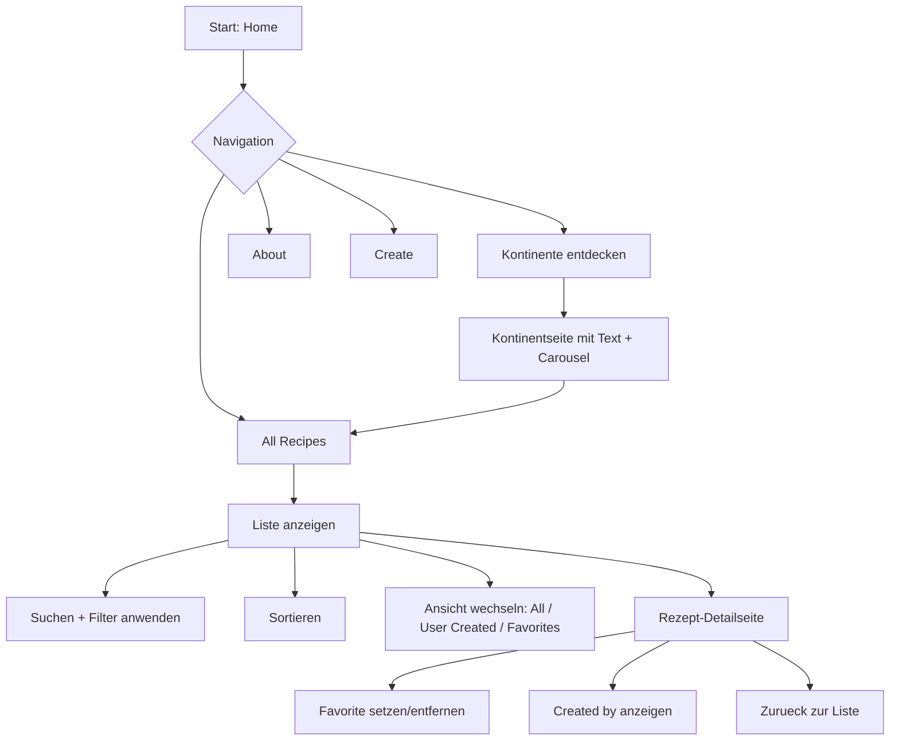
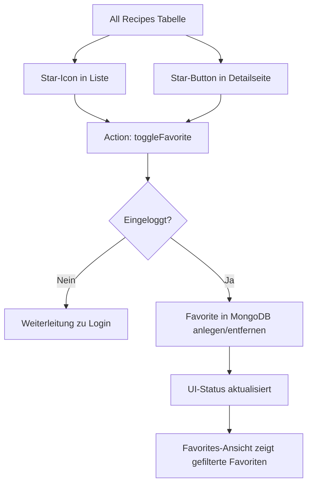

# Projektdokumentation - [Projekttitel]

## Inhaltsverzeichnis

1. [Ausgangslage](#1-ausgangslage)
2. [Lösungsidee](#2-lösungsidee)
3. [Vorgehen & Artefakte](#3-vorgehen--artefakte)
    1. [Understand & Define](#31-understand--define)
    2. [Sketch](#32-sketch)
    3. [Decide](#33-decide)
    4. [Prototype](#34-prototype)
    5. [Validate](#35-validate)
4. [Erweiterungen [Optional]](#4-erweiterungen-optional)
5. [Projektorganisation [Optional]](#5-projektorganisation-optional)
6. [KI-Deklaration](#6-ki-deklaration)
7. [Anhang [Optional]](#7-anhang-optional)

> **Hinweis:** Massgeblich sind die im **Unterricht** und auf **Moodle** kommunizierten Anforderungen.

<!-- WICHTIG: DIE KAPITELSTRUKTUR DARF NICHT VERÄNDERT WERDEN! -->

<!-- Diese Vorlage ist für eine README.md im Repository gedacht. Abschnitte mit [Optional] können weggelassen werden, wenn in den Übungen nichts anderes verlangt wird. -->

## 1. Ausgangslage <!--DONE-->
<!-- Kurz beschreiben, welches Problem adressiert wird und welches Ergebnis angestrebt ist. Wem nützt die Lösung, wer ist beteiligt oder betroffen? -->
- **Problem:** Viele Menschen interessieren sich fuer internationale Kuechen, finden aber alltagsnah oft nur verstreute, uneinheitliche oder schwer vergleichbare Rezeptinformationen. Gleichzeitig fehlen in bestehenden Sammlungen haeufig eine klare thematische Navigation (z. B. nach Kontinenten), ein einfacher Zugang zu Rezeptdetails und die Moeglichkeit, eigene Rezepte strukturiert zu erfassen und wiederzufinden. Dadurch entsteht ein Bruch zwischen Inspiration und praktischer Umsetzung beim Kochen.  
- **Ziele:**  
  - Eine uebersichtliche, responsive Webanwendung bereitstellen, die Rezepte ueber Kontinente hinweg strukturiert zugaenglich macht.  
  - Nutzer:innen ermoeglichen, eigene Rezepte zu erstellen, zu verwalten und wieder zu loeschen.  
  - Eine intuitive Navigation zwischen Inspirationsansicht (Kontinente), Gesamtliste und Detailansicht schaffen.  
  - Mit Login- und Favoritenfunktion einen persoenlichen Nutzen und wiederkehrende Nutzung unterstuetzen.  
  - Eine solide technische Basis mit SvelteKit, Bootstrap und MongoDB fuer weitere Erweiterungen schaffen.  
- **Primaere Zielgruppe:** Kochinteressierte Nutzer:innen, insbesondere Studierende und junge Erwachsene, die schnell internationale Gerichte entdecken, vergleichen und teilweise selbst kuratieren wollen.  
<!-- - **Weitere Stakeholder [Optional]:** Dozierende und Mitstudierende im Modul Prototyping (Feedback, Evaluation, Bewertung) sowie Testnutzer:innen, die Usability-Rueckmeldungen liefern. -->  

## 2. Lösungsidee
Beschreibt die Lösungsidee.
- **Kernfunktionalitaet:**
  - **Version 1 (ausformuliert):**
    1. **Entdecken ueber die Startseite und Kontinente:** Nutzer:innen starten auf der Home-Seite mit sechs Kontinent-Kacheln und gelangen von dort in kontinent-spezifische Seiten. Jede Kontinentseite bietet Einordnungstexte, Bilder und einen Carousel-Bereich, um kulinarische Kontexte schnell erfassbar zu machen.
    2. **Navigation zwischen Kontinenten und Hauptbereichen:** Ueber die globale Navigation (inkl. Continents-Dropdown) kann zwischen Home, Kontinenten, Create, All Recipes und About gewechselt werden. Dadurch ist sowohl exploratives Browsing als auch zielgerichtete Suche moeglich.
    3. **Rezepte als Gesamtliste nutzen:** In All Recipes werden alle vorhandenen Rezepte tabellarisch angezeigt. Die Spalten (z. B. Titel, Kontinent, Difficulty, Cooking Time) sind sortierbar, damit Nutzer:innen Rezepte schnell nach relevanten Kriterien ordnen koennen.
    4. **Direkter Detailzugriff aus der Liste:** Die Rezeptzeilen sind weitgehend klickbar und fuehren in die jeweilige Detailansicht. Dort werden Beschreibung, Metadaten, Zutaten, Schritte, Quelle/Ersteller sowie Favoritenstatus angezeigt.
    5. **Kontobezogene Nutzung (Sign-up/Login):** Nutzer:innen koennen ein Konto erstellen und sich einloggen. Die Sitzung wird serverseitig ueber Sessions verwaltet, damit geschuetzte Funktionen nur authentifizierten Nutzer:innen zur Verfuegung stehen.
    6. **Eigene Rezepte erstellen:** Auf der Create-Seite koennen eingeloggte Nutzer:innen Rezepte mit validierten Eingaben erstellen (u. a. Titel, Kontinent, Land, Beschreibung, Zutaten, Anweisungen, Difficulty, Zeit, Portionen). Ingredients und Instructions werden strukturiert als Liste erfasst.
    7. **Eigene Inhalte verwalten:** User-created Rezepte erscheinen in der Gesamtliste und in der Unteransicht User Created. Eigene Rezepte koennen geloescht werden; das Loeschen ist auf den/die jeweilige:n Owner:in beschraenkt.
    8. **Eigene Rezepte bearbeiten (Edit):** Fuer eigene (user-created) Rezepte steht eine Bearbeitungsansicht zur Verfuegung. Eingeloggte Owner koennen bestehende Inhalte aktualisieren, ohne ein Rezept neu anlegen zu muessen.
    9. **Suchen und filtern in All Recipes:** Die Rezeptliste bietet eine Suchfunktion sowie facettierte Filter (z. B. Kontinent, Schwierigkeitsgrad und Kochzeitbereich). Ergebnisse werden nach dem Anwenden der Filter gezielt eingegrenzt.
    10. **Favoriten verwalten:** Rezepte koennen ueber das Sternsymbol als Favorit markiert bzw. entmarkiert werden (Liste und Detailseite). Favoriten werden persistent in MongoDB gespeichert und in der Unteransicht Favorites gefiltert dargestellt.
    11. **Mehrere Rezeptansichten als Workflow:** In All Recipes koennen Nutzer:innen zwischen drei Ansichten wechseln: All Recipes, User Created und Favorites. So wird zwischen Entdecken, eigenen Inhalten und persoenlicher Kuratierung sauber getrennt.
    12. **Deploybare Webanwendung:** Das Projekt ist fuer Netlify-Deployment vorbereitet, sodass die Workflows nicht nur lokal, sondern als veroeffentlichter Web-Prototyp genutzt und validiert werden koennen.

  - **Version 2 (kurz genannt):**
    - Kontinente entdecken (Home-Kacheln + Kontinentseiten mit Carousel).
    - Global navigieren (Navbar + Continents-Dropdown).
    - Alle Rezepte tabellarisch anzeigen und sortieren.
    - In Rezept-Detailseiten wechseln und Inhalte lesen.
    - Konto erstellen, einloggen, Session nutzen.
    - Eigene Rezepte erstellen (validierte Formulareingaben).
    - Eigene Rezepte in separater Ansicht sehen, bearbeiten und loeschen (owner-basiert).
    - Rezepte ueber Suche und facettierte Filter eingrenzen (Kontinent, Difficulty, Kochzeitbereich).
    - Favoriten per Stern setzen/entfernen (persistent in MongoDB).
    - Zwischen All Recipes, User Created und Favorites wechseln.

  - **Workflow-Illustration (Mermaid):**

- **Annahmen [Optional]:**
  - Nutzer:innen moechten internationale Rezepte nicht nur lesen, sondern auch persoenlich sammeln (Favoriten) und eigene Inhalte beisteuern.
  - Eine kontinent-basierte Struktur erleichtert den Einstieg besser als eine rein lange, ungefilterte Rezeptliste.
  - Sortierbarkeit in der Tabelle ist fuer den ersten Prototyp nutzbringender als komplexe Filter- oder Suchlogik.
  - Ein einfacher Account-Flow (Sign-up/Login) reicht fuer den Prototyp aus, um geschuetzte User-Flows realistisch zu testen.
  - Persistenz in MongoDB ist notwendig, damit Inhalte und Favoriten ueber Sessions und Deployments hinweg stabil verfuegbar bleiben.

- **Abgrenzung [Optional]:**
  - Kein Image-Upload fuer eigene Rezepte (weder im Create-Formular noch in der Detailansicht).
  - Keine erweiterten Rollen/Rechte (z. B. Admin-Backoffice, Moderation, Freigabeworkflow).
  - Kein Passwort-Reset, keine E-Mail-Verifikation und kein Social Login.
  - Keine Mengenumrechnung, kein Einkaufslisten-Export, keine Naehrwertberechnung.
  - Kein Offline-Modus und keine native Mobile-App.

## 3. Vorgehen & Artefakte
Die Durchführung erfolgt phasenbasiert; dokumentieren Sie die wichtigsten Ergebnisse je Phase.

### 3.1 Understand & Define
- **Zielgruppenverständnis:** _[Problemraumanalyse, Recherche, (Proto-)Personas]_
- **Wesentliche Erkenntnisse:** _[Stichpunkte]_

### 3.2 Sketch
- **Variantenüberblick:** _[kurz]_
- **Skizzen:** _[Mehrere Varianten; Unterschiede kurz dokumentieren.]_

### 3.3 Decide
- **Gewählte Variante & Begründung:** _[Entscheidkriterien nennen]_  
- **End-to-End-Ablauf:** _[Beschreibung inkl. User Journey Map]_  
- **Mockup:** _[URL, z. B. Figma; Screenshots mit kurzen Beschreibungen]_  

### 3.4 Prototype

#### 3.4.1. Entwurf (Design)
Beschreibt die Gestaltung und Interaktion.
> **Hinweis:** Hier wird der **Prototyp** beschrieben, nicht das **Mockup**.
- **Informationsarchitektur:** _[z. B. Seiten/Navigation: Konzept, nicht die technische Umsetzung]_
- **User Interface Design:** _[wichtige Screens: Screenshots mit kurzen Erläuterungen]_  
- **Designentscheidungen:** _[zentrale Entscheidungen und Begründungen]_

#### 3.4.2. Umsetzung (Technik)
Fasst die technische Realisierung zusammen.
- **Technologie-Stack:** _[SvelteKit, Bibliotheken falls genutzt]_
- **Tooling:** _[IDE/Erweiterungen, lokale/Cloud-Tools; den Einsatz von KI beschreiben Sie im Kapitel **KI-Deklaration**]_  
- **Struktur & Komponenten:** _[Seiten, Routen, State/Stores, wichtige Komponenten]_
- **Daten & Schnittstellen:** _[Wie werden Daten gespeichert, verwaltet, abgerufen?]_
- **Deployment:** _[URL]_  
- **Besondere Entscheidungen:** _[z. B. Trade-offs, Vereinfachungen]_  

### 3.5 Validate
- **URL der getesteten Version** (separat deployt)
- **Ziele der Prüfung:** _[welche Fragen sollen beantwortet werden?]_  
- **Vorgehen:** _[moderiert/unmoderiert; remote/on-site]_  
- **Stichprobe:** _[Mit wem wurde getestet? Profil; Anzahl]_  
- **Aufgaben/Szenarien:** _[Ausformulierte Testaufgaben]_  
- **Kennzahlen & Beobachtungen:** _[z. B. Erfolgsquote, Zeitbedarf, qualitative Findings]_  
- **Zusammenfassung der Resultate:** _[Wichtigste Erkenntnisse; 2-4 Sätze]_  
- **Abgeleitete Verbesserungen:** _[Anforderungen, die als nächstes umgesetzt werden sollten, priorisiert, kurz begründet; falls Verbesserungen im Prototyp konkret umgesetzt wurden: In Kap. 4 dokumentieren]_  

## 4. Erweiterungen [Optional]
Dokumentiert Erweiterungen über den Mindestumfang hinaus.
> **Hinweis:** Jede Erweiterung ist separat nach dem folgenden Schema zu beschreiben.

### _[4.x Kurzbeschreibung / Titel]_  
- **Beschreibung & Nutzen:** _[Was wurde erweitert? Warum?]_  
- **Wo umgesetzt:** _[Wie und wo wurde es gemacht? Frontend, Backend, Datenbank?]_  
- **Referenz:** _[Wo wird die Erweiterung auch noch beschrieben, z.B. Screenshot oder Beschreibung in einem anderen Kapitel]_  
- **Aus Evaluation abgeleitet?:** _[Wurde diese Erweiterung als Folge eines in der Evaluation identifizierten Issues implementiert?]_  

> Das folgende **Beispiel** wurde bewusst kurz gehalten. Erweiterungen dürfen auch ausführlicher beschrieben werden.

### 4.1 Tabelle nach Kategorien filtern
- **Beschreibung & Nutzen:** Tabelle X kann nach Kategorie gefiltert werden, weil User typischerweise nur an einer bestimmten Kategorie interessiert sind.  
- **Wo umgesetzt:** 
  - **Frontend:** Tabelle mit Dropdown in Datei ...
  - **Backend:** Form Action ... in Datei ...
  - **Datenbank:** MongoDB-Query in Datei ...
- **Referenz:** Screenshot in Kap. x.y
- **Aus Evaluation abgeleitet?:** Ja, Issue x.y

## 5. Projektorganisation [Optional]
Beispiele:
- **Repository & Struktur:** _[Link; kurze Strukturübersicht]_  
- **Issue-Management:** _[Vorgehen kurz beschreiben]_  
- **Commit-Praxis:** _[z. B. sprechende Commits]_

## 6. KI-Deklaration
Die folgende Deklaration ist verpflichtend und beschreibt den Einsatz von KI im Projekt.

### 6.1 KI-Tools
- **Eingesetzte Tools**: _[z. B. Copilot, ChatGPT, Claude, lokale Modelle; Version/Variante wenn bekannt]_
- **Zweck & Umfang**: _[wie, wofür und in welchem Ausmass wurde KI eingesetzt (z. B. Textentwürfe, Codevorschläge, Tests, Refactoring); welche Teile stammen (ganz/teilweise) aus KI-Unterstützung?]_
- **Eigene Leistung (Abgrenzung):** _[was ist eigenständig erarbeitet/überarbeitet worden?]_

### 6.2 Prompt-Vorgehen
_[Überlegungen zu Prompt-Vorgehen, Qualität und Urheberrecht/Quellen. Wie wurde beim Prompting vorgegangen? Zu beschreiben ist die grundlegende Vorgehensweise. Einzelne, konkrete Prompts sollten höchstens als Beispiele aufgeführt werden. ]_

### 6.3 Reflexion
_[Nutzen, Grenzen, Risiken/Qualitätssicherung, ...]_

## 7. Anhang [Optional]
Beispiele:
- **Quellen:** _[verwendete Vorlagen/Assets/Modelle; Lizenz/Urheberrecht; ...]_
- **Testskript & Materialien:** _[Link/Datei]_  
- **Rohdaten/Auswertung:** _[Link/Datei]_  

