# Projektdokumentation - [Globe Recipes]

## Inhaltsverzeichnis

1. [Ausgangslage](#1-ausgangslage)
2. [Lösungsidee](#2-lösungsidee)
3. [Vorgehen & Artefakte](#3-vorgehen--artefakte)
    1. [Understand & Define](#31-understand--define)
    2. [Sketch](#32-sketch)
    3. [Decide](#33-decide)
    4. [Prototype](#34-prototype)
    5. [Validate](#35-validate)
4. [Erweiterungen](#4-erweiterungen)
5. [Projektorganisation](#5-projektorganisation)
6. [KI-Deklaration](#6-ki-deklaration)
7. [Anhang](#7-anhang)

## 1. Ausgangslage 
- **Problem:** Viele Menschen interessieren sich für internationale Küchen, finden aber alltagsnah oft nur verstreute, uneinheitliche oder schwer vergleichbare Rezeptinformationen. Gleichzeitig fehlen in bestehenden Sammlungen häufig eine klare thematische Navigation (z. B. nach Kontinenten), ein einfacher Zugang zu Rezeptdetails und die Möglichkeit, eigene Rezepte strukturiert zu erfassen und wiederzufinden. Dadurch entsteht ein Bruch zwischen Inspiration und praktischer Umsetzung beim Kochen.  
- **Ziele:**  
  - Eine übersichtliche, responsive Webanwendung bereitstellen, die Rezepte über Kontinente hinweg strukturiert zugänglich macht.  
  - Nutzer:innen ermöglichen, eigene Rezepte zu erstellen, zu verwalten und wieder zu löschen.  
  - Eine intuitive Navigation zwischen Inspirationsansicht (Kontinente), Gesamtliste und Detailansicht schaffen.  
  - Mit Login- und Favoritenfunktion einen persönlichen Nutzen und wiederkehrende Nutzung unterstützen.  
  - Eine solide technische Basis mit SvelteKit, Bootstrap und MongoDB für weitere Erweiterungen schaffen.  
- **Primäre Zielgruppe:** Kochinteressierte Nutzer:innen, insbesondere Studierende und junge Erwachsene, die schnell internationale Gerichte entdecken, vergleichen und teilweise selbst kuratieren wollen.  

## 2. Lösungsidee
- **Kernfunktionalität:**
  - **Ausformulierte Version:**
    1. **Entdecken über die Startseite und Kontinente:** Nutzer:innen starten auf der Home-Seite mit sechs Kontinent-Kacheln und gelangen von dort in kontinent-spezifische Seiten. Jede Kontinentseite bietet Einordnungstexte, Bilder und einen Carousel-Bereich, um kulinarische Kontexte schnell erfassbar zu machen.
    2. **Navigation zwischen Kontinenten und Hauptbereichen:** über die globale Navigation (inkl. Continents-Dropdown) kann zwischen Home, Kontinenten, Create, All Recipes und About gewechselt werden. Dadurch ist sowohl exploratives Browsing als auch zielgerichtete Suche möglich.
    3. **Rezepte als Gesamtliste nutzen:** In All Recipes werden alle vorhandenen Rezepte tabellarisch angezeigt. Die Spalten (z. B. Titel, Kontinent, Difficulty, Cooking Time) sind sortierbar, damit Nutzer:innen Rezepte schnell nach relevanten Kriterien ordnen können.
    4. **Direkter Detailzugriff aus der Liste:** Die Rezeptzeilen sind weitgehend klickbar und führen in die jeweilige Detailansicht. Dort werden Beschreibung, Metadaten, Zutaten, Schritte, Ersteller sowie Favoritenstatus angezeigt.
    5. **Kontobezogene Nutzung (Sign-up/Login):** Nutzer:innen können ein Konto erstellen und sich einloggen. Die Sitzung wird serverseitig über Sessions verwaltet, damit geschützte Funktionen nur authentifizierten Nutzer:innen zur Verfügung stehen.
    6. **Eigene Rezepte erstellen:** Auf der Create-Seite können eingeloggte Nutzer:innen Rezepte mit validierten Eingaben erstellen (u. a. Titel, Kontinent, Land, Beschreibung, Zutaten, Anweisungen, Difficulty, Zeit, Portionen). Ingredients und Instructions werden strukturiert als Liste erfasst.
    7. **Eigene Inhalte verwalten:** User-created Rezepte erscheinen in der Gesamtliste und in der Unteransicht User Created. Eigene Rezepte können gelöscht werden; das Löschen ist auf den/die jeweilige:n Owner:in beschränkt.
    8. **Eigene Rezepte bearbeiten (Edit):** Für eigene (user-created) Rezepte steht eine Bearbeitungsansicht zur Verfügung. Eingeloggte Owner können bestehende Inhalte aktualisieren, ohne ein Rezept neu anlegen zu müssen.
    9. **Suchen und filtern in All Recipes:** Die Rezeptliste bietet eine Suchfunktion sowie facettierte Filter (z. B. Kontinent, Schwierigkeitsgrad und Kochzeitbereich). Ergebnisse werden nach dem Anwenden der Filter gezielt eingegrenzt.
    10. **Favoriten verwalten:** Rezepte können über das Sternsymbol als Favorit markiert bzw. entmarkiert werden (Liste und Detailseite). Favoriten werden persistent in MongoDB gespeichert und in der Unteransicht Favorites gefiltert dargestellt.
    11. **Mehrere Rezeptansichten als Workflow:** In All Recipes können Nutzer:innen zwischen drei Ansichten wechseln: All Recipes, User Created und Favorites. So wird zwischen Entdecken, eigenen Inhalten und persönlicher Kuratierung sauber getrennt.
    12. **Deploybare Webanwendung:** Das Projekt ist für Netlify-Deployment vorbereitet, sodass die Workflows nicht nur lokal, sondern als veröffentlichter Web-Prototyp genutzt und validiert werden können.

  - **Zusammengefasste Version:**
    - Kontinente entdecken (Home-Kacheln + Kontinentseiten mit Carousel).
    - Global navigieren (Navbar + Continents-Dropdown).
    - Alle Rezepte tabellarisch anzeigen und sortieren.
    - In Rezept-Detailseiten wechseln und Inhalte lesen.
    - Konto erstellen, einloggen, Session nutzen.
    - Eigene Rezepte erstellen (validierte Formulareingaben).
    - Eigene Rezepte in separater Ansicht sehen, bearbeiten und löschen (owner-basiert).
    - Rezepte über Suche und facettierte Filter eingrenzen (Kontinent, Difficulty, Kochzeitbereich).
    - Favoriten per Stern setzen/entfernen (persistent in MongoDB).
    - Zwischen All Recipes, User Created und Favorites wechseln.

  - **Workflow-Illustration (Mermaid):**
  - **Gesamtworkflow (Navigation + Kernnutzung):** Diese Darstellung zeigt den typischen Hauptpfad von der Startseite über Kontinente und All Recipes bis zur Detailansicht inklusive Suche/Filter, Sortierung und Favoriteninteraktion.

```mermaid
flowchart TD
  A[Start: Home] --> B{Navigation}
  B --> C[Kontinente entdecken]
  B --> D[All Recipes]
  B --> E[About]
  B --> F[Create]

  C --> C1[Kontinentseite mit Text + Carousel]
  C1 --> D

  D --> D1[Liste anzeigen]
  D1 --> D2[Suchen + Filter anwenden]
  D1 --> D3[Sortieren]
  D1 --> D4[Ansicht wechseln: All / User Created / Favorites]
  D1 --> G[Rezept-Detailseite]

  G --> G1[Favorite setzen/entfernen]
  G --> G2[Created by anzeigen]
  G --> G3[Zurück zur Liste]
```

  - **Auth- und Owner-Workflow (Create/Edit/Delete):** Dieser Block zeigt, wie geschützte Aktionen über Login/Session abgesichert sind und dass Bearbeiten/Löschen nur für eigene (owner-basierte) Rezepte erlaubt ist.

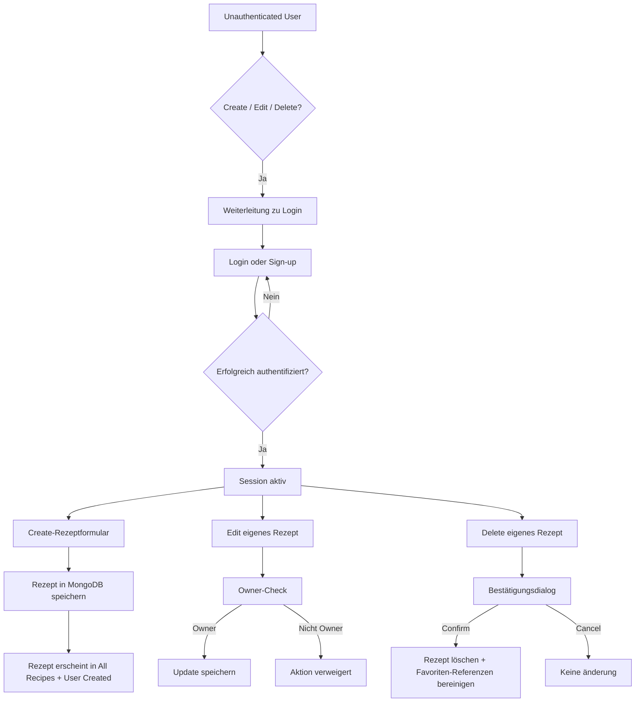
```mermaid
flowchart TD
  A[Unauthenticated User] --> B{Create / Edit / Delete?}
  B -->|Ja| C[Weiterleitung zu Login]
  C --> D[Login oder Sign-up]
  D --> E{Erfolgreich authentifiziert?}
  E -->|Nein| D
  E -->|Ja| F[Session aktiv]
  F --> G[Create-Rezeptformular]
  G --> H[Rezept in MongoDB speichern]
  H --> I[Rezept erscheint in All Recipes + User Created]

  F --> J[Edit eigenes Rezept]
  J --> K[Owner-Check]
  K -->|Owner| L[Update speichern]
  K -->|Nicht Owner| M[Aktion verweigert]

  F --> N[Delete eigenes Rezept]
  N --> O[Bestätigungsdialog]
  O -->|Confirm| P[Rezept löschen + Favoriten-Referenzen bereinigen]
  O -->|Cancel| Q[Keine änderung]
```

  - **Favoriten-Workflow:** Diese Darstellung beschreibt den Ablauf des Favoriten-Toggles (Liste/Detailseite), die Prüfung auf eingeloggte Nutzer:innen und die persistente Speicherung in MongoDB mit Ausgabe in der Favorites-Ansicht.

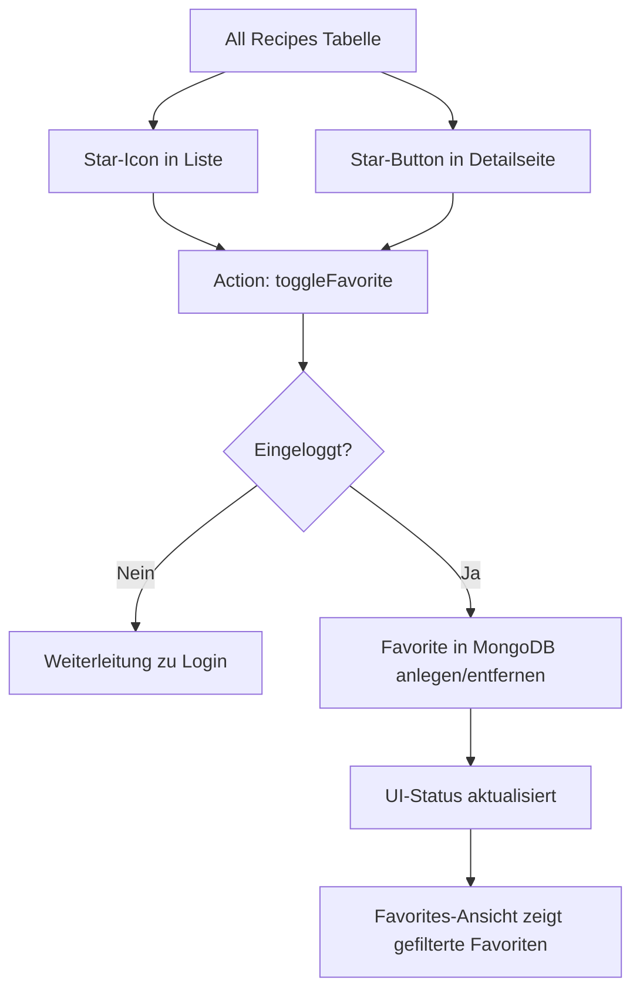
```mermaid
flowchart TD
  A[All Recipes Tabelle] --> B[Star-Icon in Liste]
  A --> C[Star-Button in Detailseite]
  B --> D[Action: toggleFavorite]
  C --> D
  D --> E{Eingeloggt?}
  E -->|Nein| F[Weiterleitung zu Login]
  E -->|Ja| G[Favorite in MongoDB anlegen/entfernen]
  G --> H[UI-Status aktualisiert]
  H --> I[Favorites-Ansicht zeigt gefilterte Favoriten]
```

- **Annahmen:**
  - Nutzer:innen möchten internationale Rezepte nicht nur lesen, sondern auch persönlich sammeln (Favoriten) und eigene Inhalte beisteuern.
  - Eine kontinent-basierte Struktur erleichtert den Einstieg besser als eine rein lange, ungefilterte Rezeptliste.
  - Sortierbarkeit in der Tabelle ist für den ersten Prototyp nutzbringender als komplexe Filter- oder Suchlogik.
  - Ein einfacher Account-Flow (Sign-up/Login) reicht für den Prototyp aus, um geschützte User-Flows realistisch zu testen.
  - Persistenz in MongoDB ist notwendig, damit Inhalte und Favoriten über Sessions und Deployments hinweg stabil verfügbar bleiben.

- **Abgrenzung:**
  - Kein Image-Upload für eigene Rezepte (weder im Create-Formular noch in der Detailansicht).
  - Keine erweiterten Rollen/Rechte (z. B. Admin-Backoffice, Moderation, Freigabeworkflow).
  - Kein Passwort-Reset, keine E-Mail-Verifikation und kein Social Login.
  - Keine Mengenumrechnung, kein Einkaufslisten-Export, keine Nährwertberechnung.
  - Kein Offline-Modus und keine native Mobile-App.

## 3. Vorgehen & Artefakte

### 3.1 Understand & Define
- **Zielgruppenverständnis:**
  - **Problemraumanalyse:** In der Analysephase wurde deutlich, dass viele Rezeptplattformen entweder sehr viele Inhalte ohne klare Struktur bieten oder kaum Möglichkeit zur persönlichen Organisation geben. Für Globe Recipes wurde deshalb ein nutzerzentrierter Fokus auf Orientierung (Kontinente), persönliche Kuratierung (Favoriten) und aktive Mitgestaltung (eigene Rezepte) gesetzt.
  - **Methodischer Ansatz (Understand/Define):** Angelehnt an Human-Centered Design wurden Zielgruppe, Nutzungskontext, Aufgaben und Frustpunkte zuerst hypothetisch über Proto-Personas beschrieben und danach in konkrete Produktanforderungen übersetzt (Navigation, Listenansichten, Authentifizierung, Create/Edit/Delete, Such- und Filterlogik).
  - **Proto-Personas:**

      | Proto-Persona 1: | Lena, Hobbyköchin |
      |---|---|
      | **Persönliche Attribute** | 25 Jahre, Studentin, digital affin, kocht 3-4x pro Woche |
      | **Umfeld** | Kocht zuhause mit Smartphone/Laptop, meist abends, begrenztes Budget |
      | **Ziele** | Neue internationale Rezepte entdecken; abwechslungsreich kochen; Rezepte schnell vergleichen |
      | **Aufgaben** | Nach Kontinent/Thema browsen; Rezeptdetails lesen; Favoriten speichern für später |
      | **Frustpunkte** | Immer gleiche Vorschläge auf grossen Plattformen; unübersichtliche Trefferlisten; zu viel Werbung/Noise |

      | Proto-Persona 2: | Marco, Food Explorer |
      |---|---|
      | **Persönliche Attribute** | 32 Jahre, berufstätig, wenig Zeit unter der Woche, neugierig auf neue Küchen |
      | **Umfeld** | Kocht hauptsächlich am Wochenende, nutzt vor allem Tablet, sucht schnell Inspiration |
      | **Ziele** | In kurzer Zeit passende Rezepte finden; nach Schwierigkeitsgrad/Kochzeit filtern; Favoritenliste aufbauen |
      | **Aufgaben** | All-Recipes-Liste nutzen; sortieren/filtern; in Detailseiten wechseln und Rezepte speichern |
      | **Frustpunkte** | Zu viele Optionen ohne Fokus; fehlende Filterbarkeit; schwer nachvollziehbare Rezeptqualität |

      | Proto-Persona 3: | Sara, Familienmanagerin |
      |---|---|
      | **Persönliche Attribute** | 40 Jahre, Mutter, organisiert Mahlzeiten für Familie, praxisorientiert |
      | **Umfeld** | Plant mehrere Gerichte pro Woche, nutzt Tablet/Notebook zuhause |
      | **Ziele** | Strukturierte Sammlung verlässlicher Rezepte; einfache Wiederauffindbarkeit; eigene Rezepte dokumentieren |
      | **Aufgaben** | Eigene Rezepte erstellen/bearbeiten; in User-Created verwalten; nicht mehr benötigte Rezepte löschen |
      | **Frustpunkte** | Rezepte gehen in Notizen/Chats verloren; keine zentrale, persönliche Verwaltung; hoher Suchaufwand |

  - **User Journey Map 1: Rezept entdecken und favorisieren (wichtigster Browse-Flow)**

      |  | 1) Einstieg & Orientierung | 2) Entdecken & Eingrenzen | 3) Bewerten & Entscheiden | 4) Merken & Wiederfinden |
      |---|---|---|---|---|
      | **Ziel** | Schnell in den passenden Bereich gelangen | Relevante Rezepte mit wenig Aufwand finden | Passendes Rezept sicher auswählen | Rezept später gezielt wiederfinden |
      | **Aktionen** | Home öffnen -> Navbar/Kontinent wählen | All Recipes öffnen -> Suche, Filter, Sortierung nutzen | Detailseite öffnen -> Zutaten, Anleitung, Metadaten prüfen | Stern setzen -> in Favorites wechseln |
      | **Touchpoints** | Home, Navbar, Kontinent-Kacheln | All-Recipes-Tabelle, Suchfeld, Filter, Sortierung | Rezeptdetailseite | Star-Icon (Liste/Detail), Favorites-Ansicht |
      | **Emotion** | Orientierung, Neugier | Fokus, Effizienz | Sicherheit bei der Auswahl | Zufriedenheit, Kontrolle |
      | **Risiko** | Zu viele Einstiegsoptionen | Zu breite Trefferliste ohne Eingrenzung | Unsicherheit bei Rezeptqualität | Favorit nicht sofort sichtbar |
      | **Mitigation** | Klare Hauptnavigation und Kontinentstruktur | Suchfunktion + facettierte Filter + Sortierung | Strukturierte Detailansicht (Zutaten/Schritte/Metadaten) | Persistente Favoriten in MongoDB + eigene Favorites-Ansicht |

  _Diese Journey beschreibt den zentralen Nutzungsfall "Rezept finden, prüfen und für später merken" und deckt den häufigsten Happy Flow im Projekt ab._

  - **User Journey Map 2: Eigenes Rezept erstellen, bearbeiten und verwalten (Creator-Flow)**

      |  | 1) Login & Zugriff | 2) Rezept erstellen | 3) Bearbeiten/Verwalten | 4) Bereinigen/Abschließen |
      |---|---|---|---|---|
      | **Ziel** | Geschützte Funktionen sicher nutzen | Eigenes Rezept korrekt erfassen | Inhalte bei Bedarf anpassen | Nicht mehr benötigte Inhalte sauber entfernen |
      | **Aktionen** | Sign-up/Login durchführen | Create-Formular ausfüllen -> absenden | In User Created öffnen -> Edit ausführen -> speichern | Delete starten -> Bestätigungsdialog bestätigen/abbrechen |
      | **Touchpoints** | Login/Sign-up, Session-Handling | Create-Seite, Formularfelder, Submit | All Recipes (User Created), Detailseite, Edit-Ansicht | Delete-Button, Modal-Dialog, Tabellenansicht |
      | **Emotion** | Vertrauen, Zugang erhalten | Produktivität, Ownership | Kontrolle über eigene Inhalte | Klarheit und Sicherheit vor Löschaktion |
      | **Risiko** | Fehlgeschlagener Login blockiert Flow | Unvollständige oder fehlerhafte Eingaben | Unklare Berechtigungen bei Bearbeitung | Versehentliches Löschen |
      | **Mitigation** | Klare Fehlermeldungen, stabile Session-Logik | Validierung und strukturierte Eingabefelder | Owner-basierte Rechteprüfung für Edit/Delete | Zentrales Bestätigungsmodal mit Cancel/Confirm |

  _Diese Journey zeigt den wichtigsten Creator-Prozess von Authentifizierung bis Verwaltung eigener Rezepte und bildet die Kernlogik der geschützten CRUD-Funktionen ab._

- **Wesentliche Erkenntnisse:**
  - **Informationsarchitektur ist zentral:** Eine kontinentbasierte Navigation senkt die Einstiegshürde und macht Discovery greifbarer als eine rein lineare Gesamtliste.
  - **Persönlicher Mehrwert entscheidet über Wiederkehr:** Favoritenfunktion und persönliche Rezeptverwaltung (Create/Edit/Delete) sind für langfristige Nutzung wichtiger als reine Lesefunktion.
  - **Effizienz im Browse-Prozess:** Suchfunktion sowie facettierte Filter (Kontinent, Difficulty, Kochzeitbereich) reduzieren Reibung und beschleunigen die Rezeptauswahl deutlich.
  - **Klare Berechtigungslogik schafft Vertrauen:** Owner-basierte Aktionen bei Bearbeiten/Löschen verhindern ungewollte Eingriffe in fremde Inhalte.
  - **Mobile-First Relevanz:** Zielgruppen nutzen die App oft auf kleineren Screens; deshalb waren responsive Navigation, klickbare Listenzeilen und kompakte Interaktionen entscheidend.
  - **Frühe Hypothesen für Validate-Phase:** Getroffene Annahmen betreffen vor allem die Nützlichkeit der Kontinentstruktur, die Akzeptanz von Favoriten und den Nutzen von Such-/Filterlogik; diese sind in der Validate-Phase gezielt testbar.

### 3.2 Sketch
- **Variantenüberblick:**
   
  Ein erster, schneller Papier-Sketch wurde im Rahmen von Crazy 8 erstellt, um mehrere Lösungsansätze in kurzer Zeit zu visualisieren; anschliessend wurden die vielversprechendsten Varianten in Figma als digitale Skizzen ausgearbeitet.

 

- **Skizzen: Crazy Eight (Papier-Sketch)**

  

  Der erste Entwurf wurde als schneller Papier-Sketch im Crazy-8-Stil erstellt. Ziel war es, in kurzer Zeit mehrere Layout- und Navigationsideen sichtbar zu machen (Home, Kontinentansicht, Rezeptdetail und Create-Flow), ohne früh in visuelle Details zu investieren.

 

- **Skizzen in Figma**

  

  **Erstes Bild:** Fokus auf der Home-Page mit klarer Navigation und Kontinent-Kacheln. Diese Richtung liegt nahe an der aktuell umgesetzten Startseite und wurde deshalb als solide Basis für die weitere Ausarbeitung genutzt.

   

  

  **Zweites Bild:** Rezept-übersicht als Kachelgrid mit grossen Bildern. Der Ansatz war visuell attraktiv, wurde aber als relativ aufwändig beurteilt (Bildpflege, Konsistenz und Content-Aufbereitung) und daher nicht als primäre Listenlogik weiterverfolgt.

   

  

  **Drittes Bild:** "Bare-bones"-Variante der Create-Page mit Fokus auf Eingabefluss und Formularlogik. Diese Skizze half, die benötigten Felder früh zu strukturieren und die spätere Umsetzungspriorität auf funktionale Klarheit statt reine Optik zu legen.

   

### 3.3 Decide
- **Gewählte Variante & Begründung:**  
  - Es wurde bewusst ein **Mischansatz** aus den erarbeiteten Varianten verwendet: Teile aus den Papier-/Figma-Skizzen wurden übernommen, andere Teile während der Umsetzung direkt im Projekt durch iteratives Ausprobieren und Prompting weiterentwickelt.
  - Die finale Richtung kombiniert daher frühe Entwurfsideen (z. B. kontinentbasierte Orientierung und klare Hauptnavigation) mit pragmatischen Entscheidungen aus der Implementierungsphase.
  - Die Variante "Rezeptliste als Kacheln mit grossen Bildern" wurde nicht als Hauptdarstellung umgesetzt, da Erstellung/Pflege geeigneter Bilder sowie konsistente Bildqualität einen deutlich höheren Aufwand verursacht hätten.
  - **Entscheidungskriterien im Projekt:**
    - **Nutzbarkeit zuerst:** schnelle Orientierung, klarer Ablauf, wenige Klicks bis zur Rezeptdetailseite.
    - **Umsetzbarkeit im Modulrahmen:** Fokus auf stabile Kernfunktionen statt aufwendige Medienproduktion.
    - **Wartbarkeit:** strukturierte Listen-, Filter- und CRUD-Logik sind leichter erweiterbar als bildlastige Sonderlayouts.
    - **Technische Konsistenz:** gleiche Interaktionsmuster in Navigation, Listenansichten und Detailseiten.

- **End-to-End-Ablauf:**  
  - Der Ablauf wurde als task-orientierte User Journey (Happy Flow) definiert, im Sinn von "konkrete Aufgabenerledigung mit dem Produkt":
    1. **Einstieg & Orientierung:** Home-Page öffnen und über Navbar/Kontinent-Kacheln in die gewünschte Richtung navigieren.
    2. **Entdecken & Eingrenzen:** In All Recipes Rezepte durchsuchen, filtern und sortieren.
    3. **Bewerten & Entscheiden:** Rezeptdetailseite aufrufen, Zutaten/Anleitung/Metadaten prüfen, ggf. Favorit setzen.
    4. **Eigene Inhalte verwalten:** (eingeloggt) Rezept erstellen, in User Created wiederfinden, bearbeiten oder löschen.
    5. **Persönliche Kuratierung:** Favoriten in der Favorites-Ansicht gebündelt nutzen.
  - **User Journey (Happy Flow als Ablaufgrafik):**

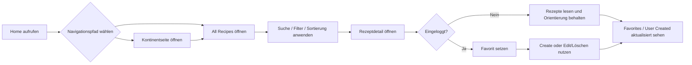
```mermaid
flowchart LR
  A[Home aufrufen] --> B{Navigationspfad wählen}
  B --> C[Kontinentseite öffnen]
  B --> D[All Recipes öffnen]
  C --> D
  D --> E[Suche / Filter / Sortierung anwenden]
  E --> F[Rezeptdetail öffnen]
  F --> G{Eingeloggt?}
  G -->|Nein| H[Rezepte lesen und Orientierung behalten]
  G -->|Ja| I[Favorit setzen]
  I --> J[Create oder Edit/Löschen nutzen]
  H --> K[Favorites / User Created später nutzen]
  J --> K[Favorites / User Created aktualisiert sehen]
```

  _Diese User Journey zeigt den zentralen Happy Flow vom Einstieg über Auswahl und Bewertung bis zur persönlichen Kuratierung._

  - **Informationsarchitektur (Hierarchie + Navigation):**

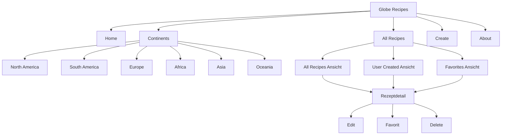
```mermaid
flowchart TD
  R[Globe Recipes]
  R --> H[Home]
  R --> CO[Continents]
  R --> AR[All Recipes]
  R --> CR[Create]
  R --> AB[About]

  CO --> NA[North America]
  CO --> SA[South America]
  CO --> EU[Europe]
  CO --> AF[Africa]
  CO --> AS[Asia]
  CO --> OC[Oceania]

  AR --> A1[All Recipes Ansicht]
  AR --> A2[User Created Ansicht]
  AR --> A3[Favorites Ansicht]
  A1 --> RD[Rezeptdetail]
  A2 --> RD
  A3 --> RD
  RD --> ED[Edit]
  RD --> FV[Favorit]
  RD --> DL[Delete]
```

  _Die Hierarchie zeigt die Seitenstruktur (oben) und die wichtigsten Navigationswege in die Rezeptdetail- und Verwaltungsfunktionen (unten)._

- **Mockup:**  
  - **Figma-Link:** `https://www.figma.com/design/tza1UKkScmChGGwkXil5RT/Globe-Recipes?node-id=0-1&t=i8ySRLhVczepAmBp-1`
  - **Einordnung der Figma-Screens im Vergleich zum aktuellen Projektstand:**
    - **Figma Screen 1 (Home):** Grundidee (Navigation + Kontinentfokus) wurde weitgehend übernommen und entspricht der aktüllen Startlogik.
    - **Figma Screen 2 (MyRecipes als Kachelansicht):** visuelle Richtung wurde nur teilweise übernommen; aktuell liegt der Fokus auf einer funktionalen Tabellen-/Listenlogik in All Recipes mit Sortierung, Filtern und Aktionen.
    - **Figma Screen 3 (Create):** die "bare-bones"-Formularidee wurde inhaltlich übernommen; im aktuellen Stand ist die Create-Seite technisch erweitert (Validierung, strukturierte Eingaben, Login-Schutz).

### 3.4 Prototype

#### 3.4.1. Entwurf (Design)
Beschreibt die Gestaltung und Interaktion.
 
- **Informationsarchitektur:**  
  Die Informationsarchitektur des Prototyps folgt einem klaren Dreiklang aus **Entdecken**, **Verwalten** und **Personalisieren**. Als primäre Orientierung dient die globale Hauptnavigation mit den Einstiegen *Home*, *Continents*, *Create*, *All Recipes* und *About*.  
  Der Bereich *Home* ist als visueller Einstieg konzipiert und führt über Kontinent-Kacheln in inhaltliche Themenräume. Die Kontinentseiten vertiefen den jeweiligen kulinarischen Kontext und leiten über klare Call-to-Actions wieder in den zentralen Rezeptbereich.  
  *All Recipes* bildet das funktionale Zentrum der Anwendung: Von dort aus gelangen Nutzer:innen in drei klar getrennte Ansichten (*All Recipes*, *User Created*, *Favorites*), sodass allgemeines Browsing, eigene Inhalte und persönliche Merkliste logisch voneinander getrennt bleiben.  
  Die Rezept-Detailseite fungiert als Entscheidungsseite, auf der Metadaten, Zutaten, Anweisungen und Interaktionsmöglichkeiten (Favorisieren, ggf. Bearbeiten/Löschen) gebündelt werden.  
  Der Bereich *Create* erweitert die Architektur um den produktiven Flow (eigene Inhalte erfassen), während *Login/Sign-up* als Zugangsschicht für geschützte Aktionen eingebunden ist.  
  Insgesamt entsteht eine flache, gut verständliche Seitenhierarchie mit wiederkehrenden Navigationsmustern und kurzen Wegen zwischen Überblick, Detail und Aktion.
   
- **User Interface Design:**  
  Das UI des Prototyps kombiniert eine atmosphärische Bildsprache (seitenbezogene Hintergrundbilder, Carousel, Kontinentgrafiken) mit funktionalen Inhaltsboxen und klaren Aktionsflächen. Für die Dokumentation werden die wichtigsten Screens entlang des Hauptflows gezeigt.
  
  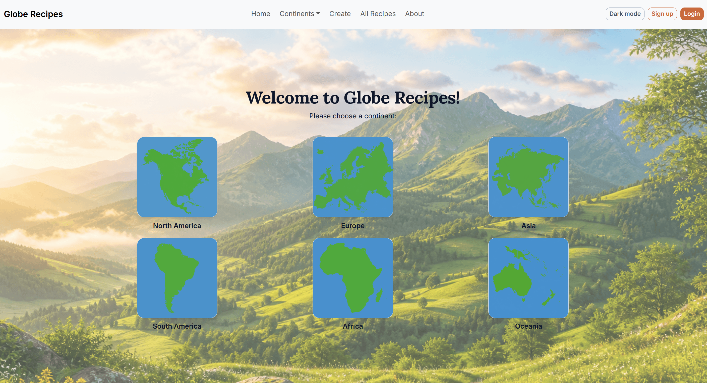
  Visueller Einstieg mit schneller Themenwahl; Fokus auf Orientierung und Motivation zum Erkunden.
    
  
  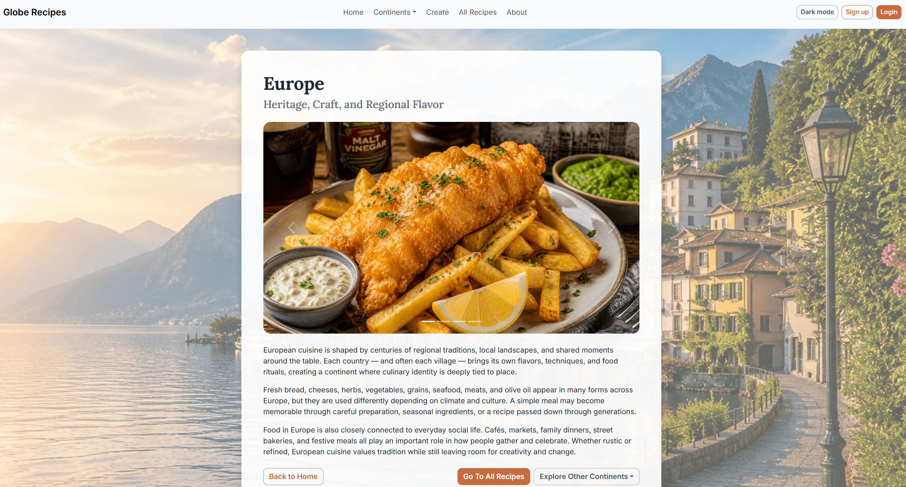
  Storytelling-Seite mit kulturellem Kontext; verbindet Inspiration mit direkter Weiterführung zu den Rezepten.
    
  
  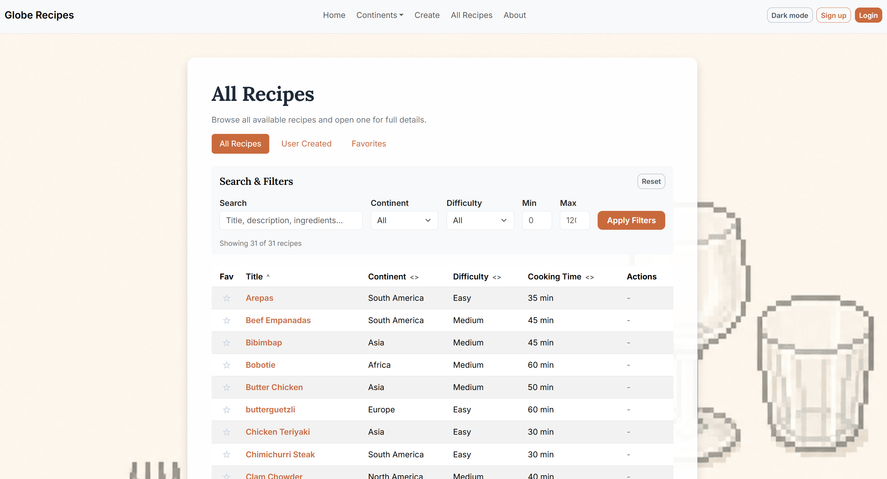
  Zentrale Arbeitsansicht für Vergleich und Auswahl; zeigt hohe Informationsdichte bei gleichzeitig strukturierter Bedienung.
    
  
  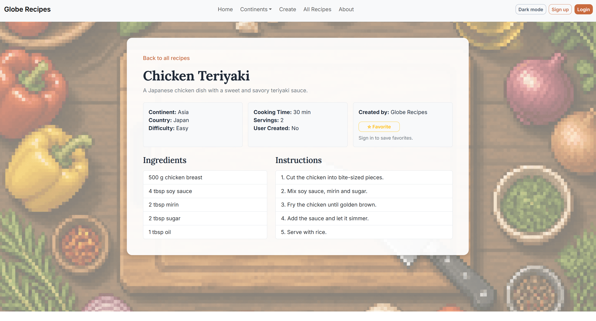
  Entscheidungs- und Handlungsseite; unterstützt sowohl Lesen als auch aktive Verwaltung.
    
  
  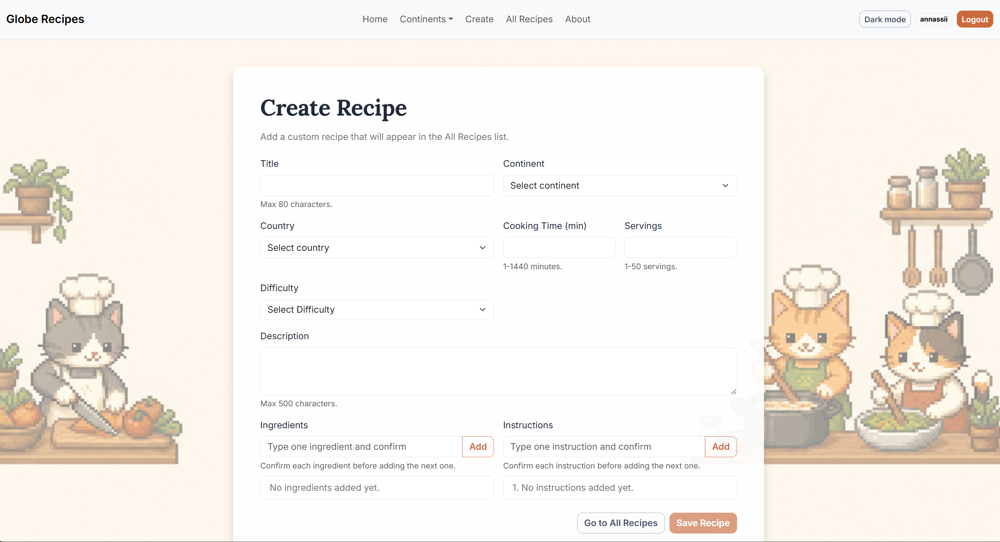
  Geführter Erfassungsprozess mit klarer Feldstruktur und unmittelbarer Rückmeldung.
    
  
  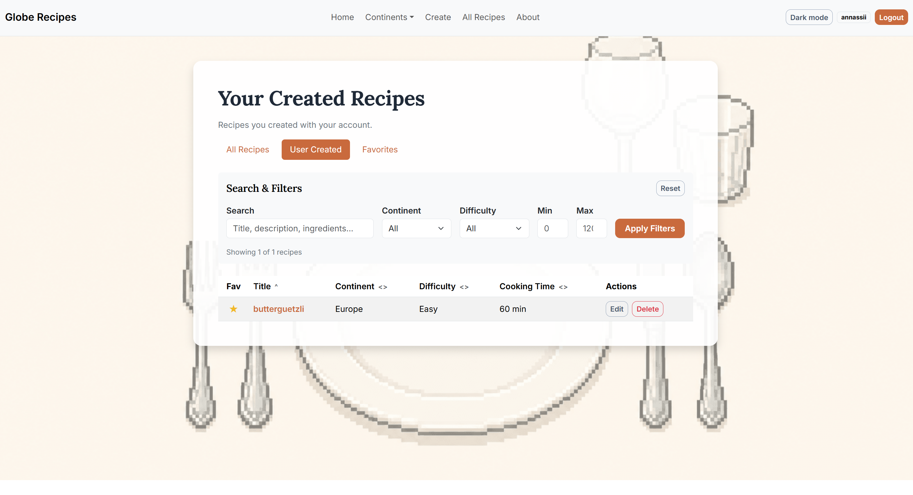
  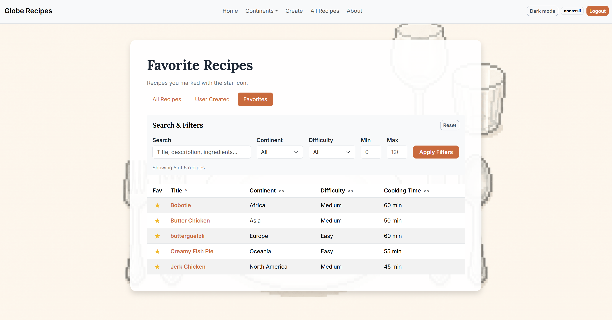
  Personalisierte Nutzungsebene; macht eigene Beiträge und gemerkte Rezepte schnell auffindbar.
    
  
  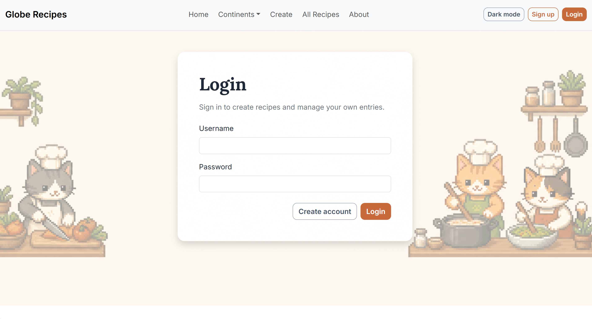
  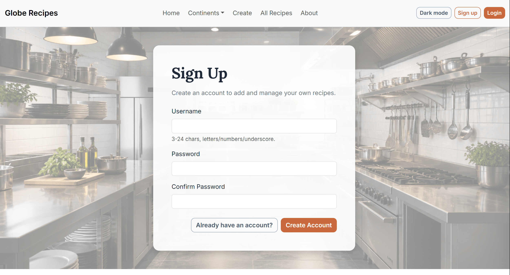
  Zugang zu geschützten Funktionen; klare, reduzierte UI mit Fokus auf erfolgreichen Abschluss.
    
- **Designentscheidungen:**  
  Zentral war die Entscheidung für eine **hybride Erlebnislogik**: emotionaler Einstieg über Kontinente plus effizientes Arbeiten in einer tabellarischen Rezeptübersicht. So werden sowohl exploratives als auch zielgerichtetes Nutzungsverhalten unterstützt.  
  Die Trennung in *All*, *User Created* und *Favorites* reduziert kognitive Last, weil Nutzer:innen je Kontext nur relevante Inhalte sehen statt einer überladenen Gesamtliste.  
  Die visuelle Gestaltung folgt dem Prinzip **starker Hintergrund, ruhiger Vordergrund**: bildreiche Flächen erzeugen Atmosphäre, während kontrastreiche Content-Container Lesbarkeit und Fokus sichern.  
  Wiederverwendete Interaktionsmuster (Buttons, Pills, Tabellenaktionen, Rücksprünge) erhöhen Vorhersehbarkeit und senken den Lernaufwand über alle Seiten hinweg.  
  Die Create-/Edit-Formulare setzen auf schrittweise, strukturierte Listenerfassung statt unstrukturierter Freitextblöcke, was Bedienklarheit und Datenqualität verbessert.  
  Für kritische Aktionen (Löschen) wurde bewusst ein Bestätigungsdialog integriert, um Fehlbedienungen zu vermeiden und Vertrauen in die Interaktion zu erhöhen.  
  Ergänzend wurde ein Light-/Dark-Mode vorgesehen, um unterschiedliche Nutzungssituationen und Präferenzen besser abzudecken und den Reifegrad des Prototyps zu stärken.

#### 3.4.2. Umsetzung (Technik)
Fasst die technische Realisierung zusammen.
- **Technologie-Stack:**  
  Der Prototyp wurde als Full-Stack-Webanwendung mit **SvelteKit (v2)** umgesetzt. Als Build- und Dev-Umgebung wird **Vite** verwendet. Im Frontend basiert das visuelle Grundgerüst auf **Bootstrap 5.3** (Layout, Utilities, Form-Komponenten, Navigation, Carousel).  
  Für die Persistenz wurde **MongoDB** eingesetzt; die Anbindung erfolgt über den offiziellen Node-Treiber (`mongodb`).  
  Für die Authentifizierung werden Passwörter mit **bcryptjs** gehasht, Sitzungen serverseitig gespeichert und über sichere Cookies verwaltet.  
  Zusätzlich wird `country-list` für standardisierte Länderauswahlen in den Formularen verwendet.  
  Das Projekt ist über den **SvelteKit Netlify Adapter** auf Deployment in Netlify vorbereitet.
- **Tooling:**  
  Die Entwicklung erfolgt als Node.js-Projekt mit `npm`-Skripten für lokale Ausführung und Build: `npm run dev`, `npm run build`, `npm run preview`.  
  Für Datenbankvorbereitung und Initialdaten wurden projektspezifische Skripte umgesetzt (`db:setup`, `db:seed`).  
  Zusätzlich existiert ein Skript zur Bildoptimierung (`images:compress`), damit statische Assets für die Webauslieferung effizient bleiben.  
  Konfiguration und Laufzeitparameter werden über `.env`-Dateien und Umgebungsvariablen verwaltet (`MONGODB_URI`, `MONGODB_DB_NAME`, `APP_AUTH_SECRET`).
- **Struktur & Komponenten:**  
  Die Anwendung nutzt die dateibasierte Routing-Struktur von SvelteKit. Die globale Seitenhülle wird über `+layout.svelte` bereitgestellt und enthält die Hauptnavigation, Theme-Umschaltung (Light/Dark) sowie den zentralen Content-Bereich.  
  Hauptseiten sind: Startseite (`/`), Kontinent-Navigation (`/continents` + Unterseiten je Kontinent), Rezeptbereich (`/all-recipes`), Rezeptdetails (`/all-recipes/[id]`), Erstellen (`/create`), Bearbeiten (`/all-recipes/[id]/edit`), Auth-Seiten (`/login`, `/sign-up`) und `/about`.  
  Der Rezeptbereich ist in drei Nutzungsansichten gegliedert: **All Recipes**, **User Created** und **Favorites**.  
  Wiederverwendbare UI-Bausteine wurden als Komponenten ausgelagert, u. a. `NavBar`, `PageShell`, `ContentBox`, `RecipesTable`, `RecipesViewNav`, `ContinentInfoPage`, `ImageCarousel` und `ConfirmDeleteModal`.  
  Die Zustandslogik in den Svelte-Komponenten nutzt Svelte-5-Reaktivität (`$state`, `$derived`, `$effect`) z. B. für Sortierung, Filter, Formularlisten und UI-Dialoge.
- **Daten & Schnittstellen:**  
  Die Datenzugriffe sind serverseitig gekapselt in `src/lib/server/recipes-db.js` und `src/lib/server/auth-db.js`. Dadurch bleiben Datenbankdetails von der UI getrennt.  
  Für Rezepte existieren CRUD-nahe Funktionen (lesen, erstellen, aktualisieren, löschen) inklusive Ownership-Prüfung für benutzererstellte Inhalte.  
  Favoriten werden in einer separaten Collection gespeichert und über Toggle-Aktionen aus Liste und Detailseite gesteuert.  
  Die Kommunikation zwischen Frontend und Backend erfolgt über SvelteKit-`load`-Funktionen und `actions` in den jeweiligen `+page.server.js`-Dateien.  
  Formulare werden serverseitig validiert (z. B. Pflichtfelder, Längen, numerische Bereiche, erlaubte Werte). Fehler werden mit passenden HTTP-Statuscodes und nutzbaren Rückmeldungen an die Oberfläche zurückgegeben.  
  Authentifizierung basiert auf Session-Token in Cookies; pro Request wird der Benutzerkontext über `hooks.server.js` in `locals.user` geladen und für geschützte Routen/Aktionen verwendet.
- **Deployment:**  
  Das Projekt ist für **Netlify** konfiguriert. In `netlify.toml` sind Build-Befehl (`npm run build`) und Publish-Verzeichnis (`build`) hinterlegt; Funktionen werden über `.netlify/functions-internal` bereitgestellt.  
  Für eine produktive Auslieferung müssen die benötigten Umgebungsvariablen in Netlify gesetzt werden (insbesondere Datenbank- und Auth-Secret-Werte).     
  Öffentliche URL der Test-/Produktivinstanz: `https://globerecipes.netlify.app/`.
- **Besondere Entscheidungen:**  
  Eine zentrale technische Entscheidung war die Trennung von UI und Datenlogik: Komponenten bleiben primär für Darstellung/Interaktion zuständig, während Datenzugriffe und Fehlerbehandlung in dedizierten Servermodulen liegen.  
  Für Listenansichten wurde bewusst eine tabellarische Darstellung mit Such-/Filter-/Sortierlogik gewählt, da sie im Prototyp einen hohen funktionalen Nutzen bei moderatem Implementierungsaufwand bietet.  
  Zugriffsregeln für Edit/Delete wurden strikt auf Besitzer:innen benutzererstellter Rezepte begrenzt, um Datenkonsistenz und Sicherheit im Mehrnutzerkontext sicherzustellen.  
  Kritische Aktionen (Delete) wurden mit einer expliziten Bestätigung abgesichert, um Fehlaktionen zu reduzieren.  
  Für wiederkehrende Seitenmuster (Hintergrundbild + lesbarer Inhaltsbereich) wurden `PageShell` und `ContentBox` als wiederverwendbares Design-System im Kleinen eingeführt, was Konsistenz und Wartbarkeit erhöht.

### 3.5 Validate TODO TODO TODO
- **URL der getesteten Version** (separat deployt):
- **Ziele der Prüfung:** _[welche Fragen sollen beantwortet werden?]_  
- **Vorgehen:** _[moderiert/unmoderiert; remote/on-site]_  
- **Stichprobe:** _[Mit wem wurde getestet? Profil; Anzahl]_  
- **Aufgaben/Szenarien:** _[Ausformulierte Testaufgaben]_  
- **Kennzahlen & Beobachtungen:** _[z. B. Erfolgsquote, Zeitbedarf, qualitative Findings]_  
- **Zusammenfassung der Resultate:** _[Wichtigste Erkenntnisse; 2-4 Sätze]_  
- **Abgeleitete Verbesserungen:** _[Anforderungen, die als nächstes umgesetzt werden sollten, priorisiert, kurz begründet; falls Verbesserungen im Prototyp konkret umgesetzt wurden: In Kap. 4 dokumentieren]_  

## 4. Erweiterungen 
Dokumentiert Erweiterungen über den Mindestumfang hinaus.

### 4.1 Dark Mode mit persistenter Theme-Auswahl
- **Beschreibung & Nutzen:** Die Anwendung wurde um einen Light-/Dark-Mode erweitert, der direkt in der Navigation umschaltbar ist. Die Auswahl bleibt über Seitenwechsel und neue Sessions hinweg erhalten. Das verbessert die Nutzbarkeit bei unterschiedlichen Lichtverhältnissen und erhöht den Reifegrad der Oberfläche.
- **Wo umgesetzt:** Frontend: Theme-Toggle und globale Theme-Variablen in `src/routes/+layout.svelte`, frühes Theme-Setzen zur Vermeidung von Flashing in `src/app.html`, Darstellungskompatibilität in Komponentenstilen (u. a. `ContentBox`, Tabellen, Modal). Backend/Datenbank: nicht erforderlich, da persistente Speicherung über `localStorage` erfolgt.
- **Referenz:** Kap. 3.4.1 (Designentscheidungen) und sichtbare Umschaltung in den UI-Screens.  
 
  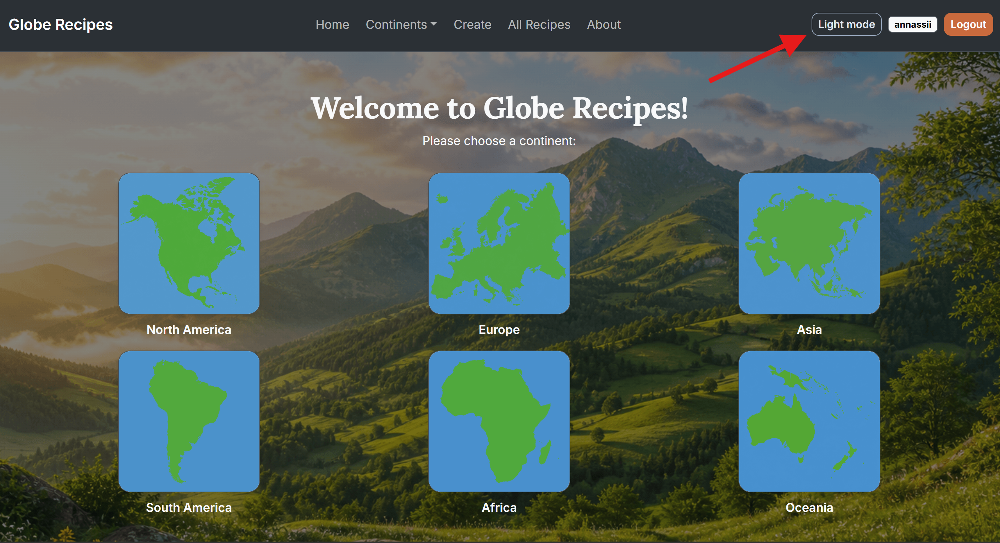   
  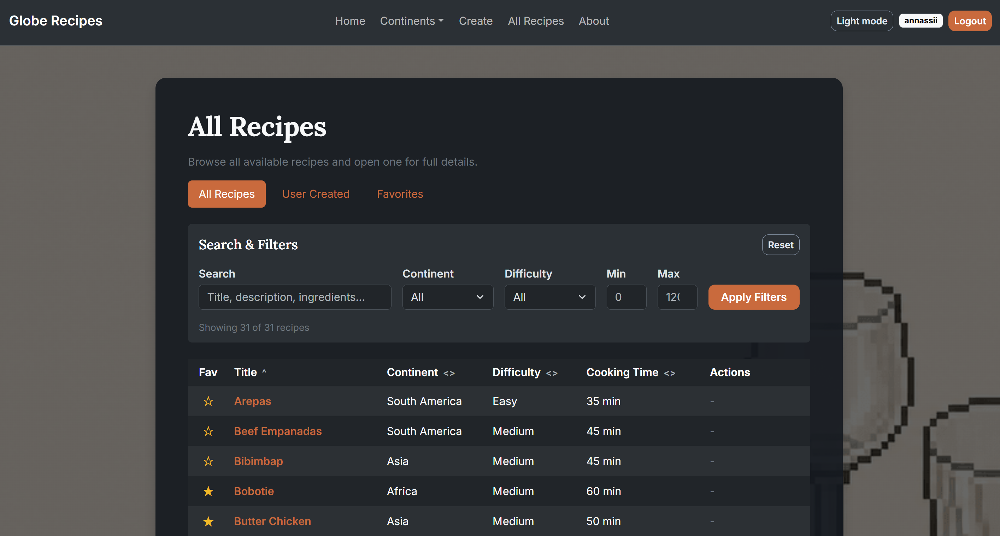  

- **Aus Evaluation abgeleitet?:** Nein, initial als Qualitäts- und UX-Erweiterung umgesetzt.

### 4.2 Benutzerkonto mit Login-, Sign-up- und Session-Flow
- **Beschreibung & Nutzen:** Über den Mindestumfang hinaus wurde ein vollständiger Authentifizierungsprozess umgesetzt: Kontoerstellung, Login, Logout, Session-Verwaltung sowie Schutz für personalisierte Aktionen. Dadurch können eigene Inhalte und Favoriten benutzerbezogen und sicher verwaltet werden.
- **Wo umgesetzt:** Frontend: Formulare in `src/routes/login/+page.svelte` und `src/routes/sign-up/+page.svelte`, Logout in `src/lib/components/NavBar.svelte`. Backend: Actions in `src/routes/login/+page.server.js`, `src/routes/sign-up/+page.server.js`, Logout-Endpunkt `src/routes/logout/+server.js`, Session-Laden über `src/hooks.server.js`, Auth-Logik in `src/lib/server/auth-db.js` (Passwort-Hashing, Session-Tokens, Cookie-Handling). Datenbank: Collections `users` und `sessions` mit Indizes in `auth-db.js`.
- **Referenz:** Kap. 3.4.2 (Daten & Schnittstellen).
- **Aus Evaluation abgeleitet?:** Nein, als funktionale Erweiterung für personalisierte Nutzung umgesetzt.

### 4.3 Zeicheneinschränkungen und erweiterte Validierung im Create-Formular
- **Beschreibung & Nutzen:** Das Create-Formular wurde um systematische Feldgrenzen und Plausibilitätsprüfungen erweitert (z. B. Titel, Beschreibung, Zutaten, Schritte, Kochzeit, Portionen). Dadurch wird die Datenqualität erhöht, fehlerhafte Eingaben werden früh abgefangen und die Stabilität der nachgelagerten Listen-/Detailansichten verbessert.
- **Wo umgesetzt:** Frontend: Eingabegrenzen über `maxlength`, `min`, `max` sowie strukturierte Erfassung von Zutaten/Schritten in `src/routes/create/+page.svelte`. Backend: zentrale Validierungslogik mit Grenzwerten (`LIMITS`) in `src/routes/create/+page.server.js` inklusive Fehlerbehandlung per `fail(...)`. Datenbank: indirekte Qualitätsverbesserung durch validierte Datensätze vor dem Speichern.
- **Referenz:** Kap. 3.4.1 (Create-Screen) und Kap. 3.4.2 (Form-Validierung).
- **Aus Evaluation abgeleitet?:** Nein, als robuste Basis für konsistente Eingaben umgesetzt.

### 4.4 Drei getrennte Ansichten in All Recipes (All, User Created, Favorites)
- **Beschreibung & Nutzen:** Die Rezeptübersicht wurde in drei Nutzungsmodi aufgeteilt. Nutzer:innen können zwischen Gesamtbestand, eigenen Rezepten und Favoriten wechseln. Diese Trennung verbessert Orientierung, reduziert kognitive Last und unterstützt unterschiedliche Aufgaben (Entdecken, Verwalten, Personalisieren).
- **Wo umgesetzt:** Frontend: Navigations-Pills in `src/lib/components/RecipesViewNav.svelte`, Einbindung in `src/routes/all-recipes/+page.svelte`, `src/routes/all-recipes/user-created/+page.svelte`, `src/routes/all-recipes/favorites/+page.svelte`. Backend: getrennte Lade- und Action-Logik in den jeweiligen `+page.server.js`-Dateien. Datenbank: Nutzung der Rezept- und Favoriten-Collections über `src/lib/server/recipes-db.js`.
- **Referenz:** Kap. 3.3 (Informationsarchitektur) sowie Screens `ui6_1_created_list.png` und `ui6_2_favorite_list.png` in Kap. 3.4.1.
- **Aus Evaluation abgeleitet?:** Teilweise; konzeptionell früh geplant und für bessere Nutzungsführung vertieft.

### 4.5 Auf- und absteigende Sortierung in All Recipes
- **Beschreibung & Nutzen:** Die Tabelle unterstützt interaktive Sortierung pro Spalte mit Richtungswechsel (aufsteigend/absteigend). Das beschleunigt Vergleiche und hilft, relevante Rezepte schneller zu finden.
- **Wo umgesetzt:** Frontend: Sortierzustände und Sortierlogik in `src/lib/components/RecipesTable.svelte` (`sortColumn`, `sortDirection`, `toggleSort`, `sortedRecipes`). Backend/Datenbank: keine zusätzliche Logik, da Sortierung innerhalb der geladenen Ergebnisliste im Frontend erfolgt.
- **Referenz:** Kap. 3.4.1 (All-Recipes-Screen). 
  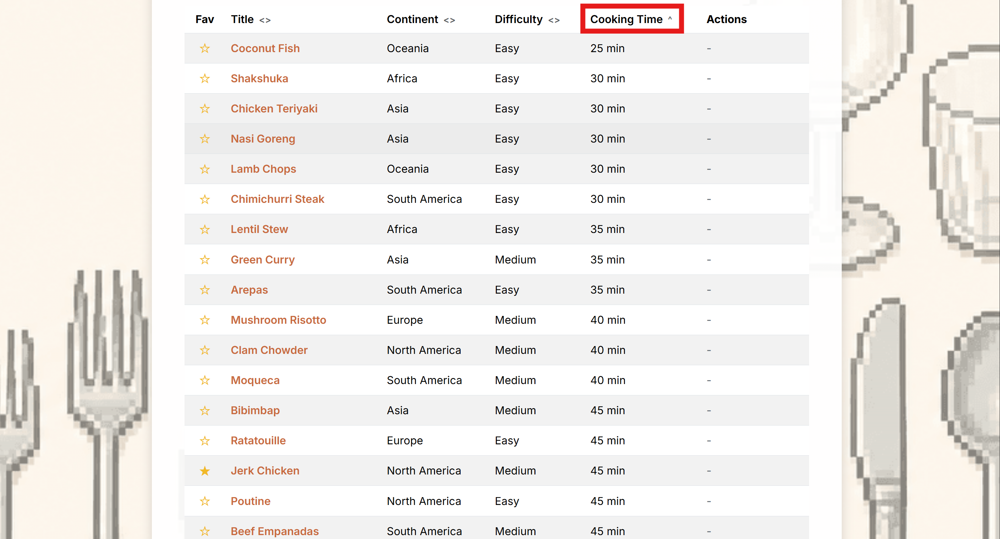   
  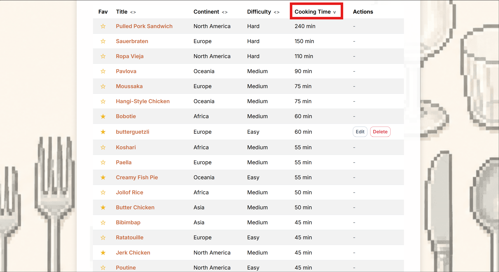
   
- **Aus Evaluation abgeleitet?:** Nein, als Effizienz-Erweiterung implementiert.

### 4.6 Erweiterte Filterfunktion in All Recipes
- **Beschreibung & Nutzen:** Zusätzlich zur Grundauflistung wurde eine kombinierbare Filter- und Suchfunktion umgesetzt: Volltextsuche, Kontinent-Filter, Difficulty-Filter sowie Kochzeit-Min/Max und Reset. Damit lassen sich große Rezeptmengen deutlich zielgerichteter eingrenzen.
- **Wo umgesetzt:** Frontend: Filterformular, Anwendungslogik und Berechnung der Ergebnislisten in `src/lib/components/RecipesTable.svelte` (`applyFilters`, `resetFilters`, `filteredRecipes`). Backend/Datenbank: Bereitstellung der Rezeptdaten über bestehende Ladefunktionen; Filterung bewusst im Frontend für direkte Interaktionsrückmeldung im Prototyp.
- **Referenz:** Kap. 3.4.1 (Screenshot All Recipes) und Kap. 2 (Kernfunktionalität).
 

  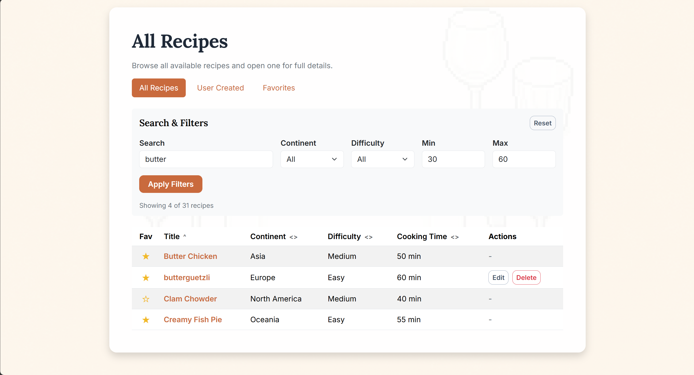
   

- **Aus Evaluation abgeleitet?:** Teilweise; Bedarf aus Problemdefinition abgeleitet und im Prototyp vertieft umgesetzt.

### 4.7 Weitere Erweiterungen über die genannten Punkte hinaus
- **Beschreibung & Nutzen:** Weitere umgesetzte Erweiterungen sind die persistente Favoritenfunktion (Toggle in Liste und Detail), owner-basierte Rechteprüfung für Bearbeiten/Löschen sowie ein Lösch-Bestätigungsdialog. Diese Funktionen verbessern Sicherheit, Datenintegrität und Fehlertoleranz in realen Nutzungssituationen.
- **Wo umgesetzt:** Frontend: Favorite-Interaktion und Delete-Dialog in `src/lib/components/RecipesTable.svelte`, `src/routes/all-recipes/[id]/+page.svelte`, `src/lib/components/ConfirmDeleteModal.svelte`, Edit-UI in `src/routes/all-recipes/[id]/edit/+page.svelte`. Backend: Actions und Rechteprüfungen in `src/routes/all-recipes/+page.server.js`, `src/routes/all-recipes/user-created/+page.server.js`, `src/routes/all-recipes/favorites/+page.server.js`, `src/routes/all-recipes/[id]/+page.server.js`, `src/routes/all-recipes/[id]/edit/+page.server.js`. Datenbank: Favoriten-Collection und Ownership-Checks in `src/lib/server/recipes-db.js`.
- **Referenz:** Screens `ui3_recipelist.png`, `ui4_recipedetailpage.png`, `ui6_1_created_list.png`, `ui6_2_favorite_list.png` in Kap. 3.4.1.  

  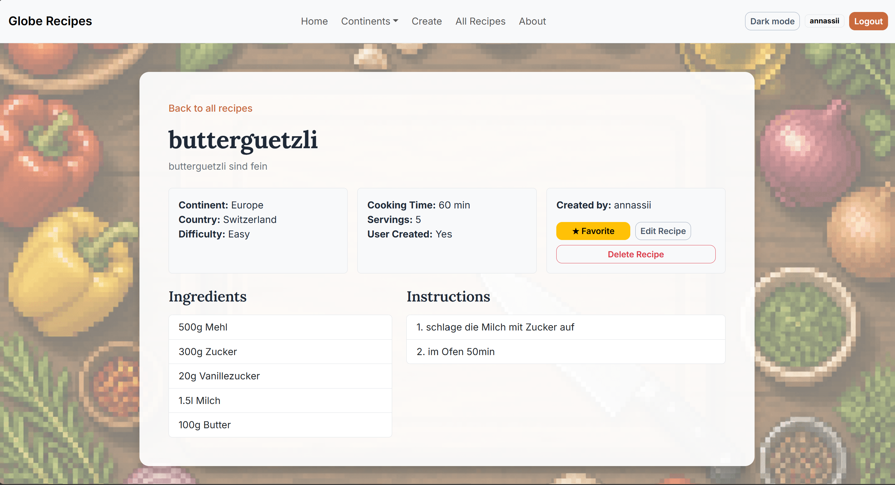  
   
  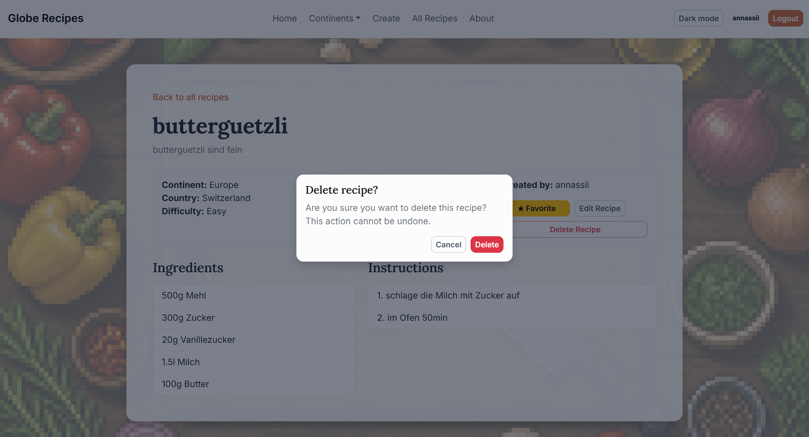  
- **Aus Evaluation abgeleitet?:** Nein, als gezielte funktionale Erweiterung für realistische Workflows umgesetzt.

## 5. Projektorganisation
- **Repository & Struktur:**  
  Das Projekt wurde als zentrales Git-Repository organisiert und folgt einer klaren Trennung zwischen UI, Routing, serverseitiger Logik und statischen Assets.  
  Der Hauptcode liegt unter `src/`:  
  - `src/routes` enthält die Seitenstruktur und Workflows (Home, Continents, All Recipes, Detail, Create, Edit, Login, Sign-up).  
  - `src/lib/components` bündelt wiederverwendbare Bausteine wie Navigation, Tabellenansicht, Layout-Hüllen und Dialoge, damit UI-Logik nicht mehrfach implementiert werden muss.  
  - `src/lib/server` kapselt die Datenbank- und Authentifizierungslogik, wodurch Zugriffe auf MongoDB sowie Session-Handling zentral und wartbar bleiben.  
  - `src/lib/data` enthält statische Strukturdaten (z. B. Kontinente, Länderlisten), die an mehreren Stellen konsistent wiederverwendet werden.  
  Ergänzend liegen in `static/` alle Bild- und Dokumentationsassets, was die Trennung zwischen Anwendungslogik und Medieninhalt unterstützt.  
  Für wiederkehrende Projektaufgaben wurden in `scripts/` Hilfsskripte für Datenbank-Setup, Seeding und Bildoptimierung abgelegt. Dadurch bleibt die Entwicklungsumgebung reproduzierbar und neue Teammitglieder können das Projekt schneller lokal starten.  
  Insgesamt wurde die Struktur so gewählt, dass sowohl die Weiterentwicklung von Features (z. B. neue Rezeptansichten) als auch die Wartung bestehender Funktionen mit überschaubarem Aufwand möglich bleibt.
- **Commit-Praxis:**  
  Die Commit-Praxis wurde auf nachvollziehbare, thematisch fokussierte Änderungen ausgerichtet. Einzelne Commits bündeln jeweils einen funktionalen Schritt (z. B. neue Ansicht, Formularvalidierung, UI-Refactoring), statt viele unterschiedliche Änderungen in einem großen Sammel-Commit zu vermischen.  
  Dadurch bleibt die Entwicklungshistorie lesbar: Entscheidungen lassen sich rückwirkend besser verstehen, Fehlerquellen schneller eingrenzen und Änderungen einfacher diskutieren.  
  Bei funktionalen Erweiterungen wurde darauf geachtet, Frontend- und Backend-Anpassungen konsistent im selben Änderungszusammenhang zu versionieren, damit ein Commit immer einen lauffähigen Zwischenstand repräsentiert.  

## 6. KI-Deklaration
Die folgende Deklaration ist verpflichtend und beschreibt den Einsatz von KI im Projekt.

### 6.1 KI-Tools
- **Eingesetzte Tools:**  
  Für die Entwicklung wurde primär **GPT-Codex-5.3** in der IDE mit **Reasoning: high** verwendet.  
  Für Bildmaterial (insbesondere projektspezifische UI-/Dokumentationsbilder) wurde zusätzlich der **ChatGPT-Bildgenerator** eingesetzt.  
  Im Projektkontext wurden ausserdem zwei KI-Instruktionsdateien verwendet, um das Verhalten in der IDE zu steuern: `CODEX_INSTRUCTIONS.md` und `.github/copilot-instructions.md`.
- **Zweck & Umfang:**  
  Codex wurde in diesem Projekt in großem Umfang genutzt. Der Einsatz umfasste vor allem:
  - Erstellung von Code-Entwürfen und teilweise direkt übernommener Implementierungen für Frontend, Routing, Formularlogik und serverseitige Funktionen.
  - Unterstützung bei der Strukturierung und Formulierung der README-Dokumentation (inkl. inhaltlicher Ausarbeitung mehrerer Kapitel).
  - Unterstützung bei der Ausarbeitung von Workflows und Diagrammen; insbesondere bei der Erstellung von Mermaid-Flowcharts.
  - Unterstützung bei der visuellen Ausgestaltung über KI-generierte Bilder.
  
  Umfangmässig stammt ein grosser Teil der initialen Code-Drafts sowie wesentliche Teile der Dokumentationsentwürfe aus KI-unterstützter Arbeit; diese Inhalte wurden anschliessend im Projektkontext geprüft, angepasst und integriert.
- **Eigene Leistung (Abgrenzung):**  
  Eigenständig umgesetzt wurden insbesondere:
  - Einrichtung der technischen Infrastruktur (u. a. Netlify-Deployment und MongoDB-Konfiguration mit separatem Datenbank-User).
  - Entscheidung, welche KI-Vorschläge übernommen, verworfen oder angepasst wurden.
  - Definition der Designvorstellungen und funktionalen Prioritäten des Produkts.
  - Durchführung und Bewertung von Tests sowie Qualitätskontrolle der umgesetzten Funktionen.
  - Zusammenführung aller Bausteine zu einer lauffähigen Gesamtlösung.

### 6.2 Prompt-Vorgehen
Das Prompting erfolgte iterativ und aufgabenorientiert. Typischer Ablauf:
- Zuerst wurde ein klarer Arbeitsauftrag formuliert (z. B. Feature, Refactoring oder Dokumentationsabschnitt) und als Draft angefordert.
- Vor Ausführung grösserer Änderungen wurde jeweils geprüft bzw. nachgefragt, ob der Auftrag korrekt verstanden wurde.
- Anschliessend wurden Ergebnisse schrittweise verfeinert (z. B. Struktur anpassen, sprachlich präzisieren, technische Details konkretisieren).
- Für Infrastrukturthemen wurden gezielt unterstützende Hinweise eingeholt (insbesondere zur Einrichtung von MongoDB und Netlify).
- Für gewünschte Ergebnisformen wurden Referenzen genutzt, unter anderem Screenshots aus Vorlesungen, um ähnliche Aufbauprinzipien zu erzielen.

Zur Qualitätssicherung wurden KI-Ausgaben nicht ungeprüft übernommen, sondern anhand der Projektanforderungen, der bestehenden Codebasis und der tatsächlichen Lauffähigkeit kontrolliert. Bei Unsicherheiten wurden Ausgaben nachpräzisiert oder manuell korrigiert.

### 6.3 Reflexion
Der KI-Einsatz brachte einen deutlichen Produktivitätsgewinn, insbesondere bei der schnellen Erstellung von Prototyp-Code, bei der Strukturierung komplexerer Funktionen und bei der Dokumentationsarbeit. Auch die Erstellung von Diagrammen und visualisierenden Inhalten konnte stark beschleunigt werden.

Gleichzeitig zeigten sich klare Grenzen: KI-generierte Vorschläge sind nicht automatisch konsistent mit der bestehenden Architektur, können fachliche Annahmen enthalten und müssen technisch wie inhaltlich verifiziert werden. Das betrifft insbesondere Validierungslogik, Berechtigungsregeln und Datenbankinteraktionen.

Die zentralen Risiken lagen in möglicher Fehlinterpretation von Anforderungen, übergenerischen Lösungen und inkonsistenter Qualität einzelner Entwürfe. Diese Risiken wurden durch systematische Prüfung reduziert: schrittweises Vorgehen, gezielte Nachfragen, manuelle Anpassung, Tests der Funktionen und Abgleich mit den Projektzielen.

Insgesamt war KI ein sehr wirksames Entwicklungswerkzeug, aber nicht Ersatz für eigene technische Entscheidungen. Der finale Projektstand entstand durch die Kombination aus KI-Entwürfen und eigenständiger Auswahl, Integration, Korrektur und Qualitätssicherung.

## 7. Anhang
- **Quellen:**
  - SvelteKit Dokumentation: `https://kit.svelte.dev/docs`
  - Bootstrap Dokumentation: `https://getbootstrap.com/docs/5.3/getting-started/introduction/`
  - MongoDB Dokumentation: `https://www.mongodb.com/docs/`
  - Netlify Dokumentation: `https://docs.netlify.com/`

