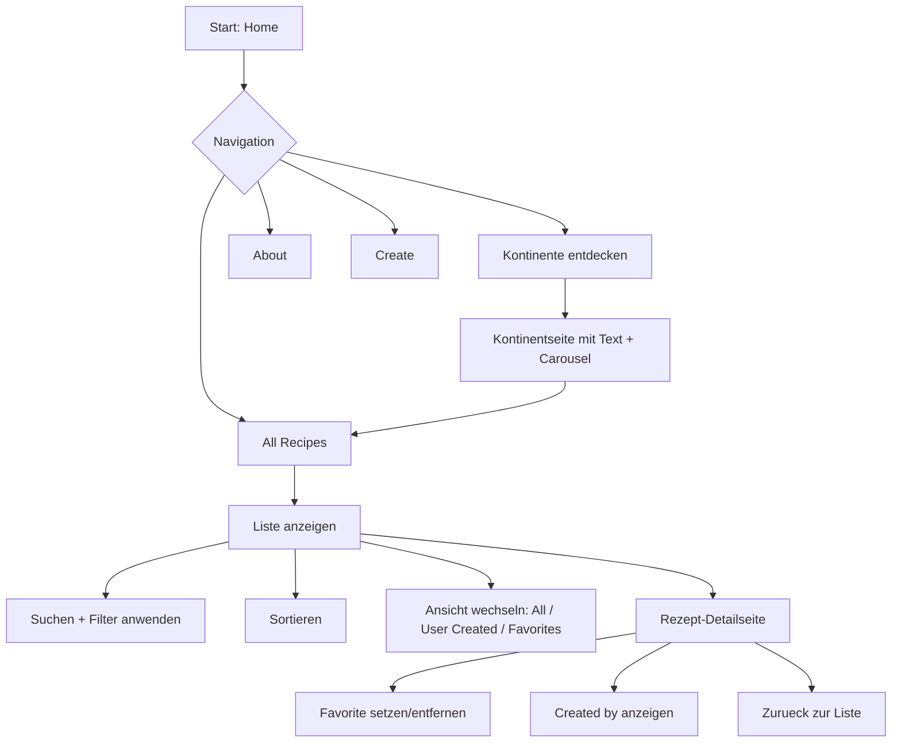
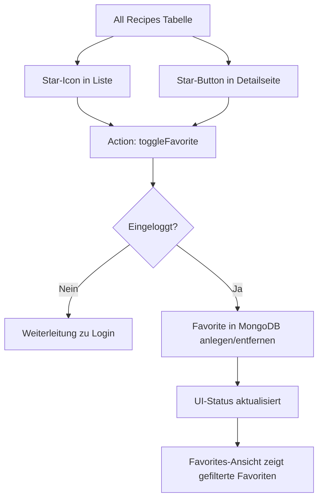
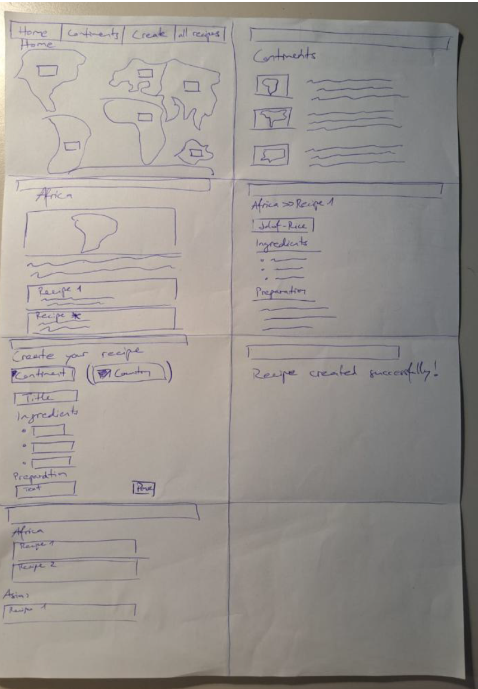
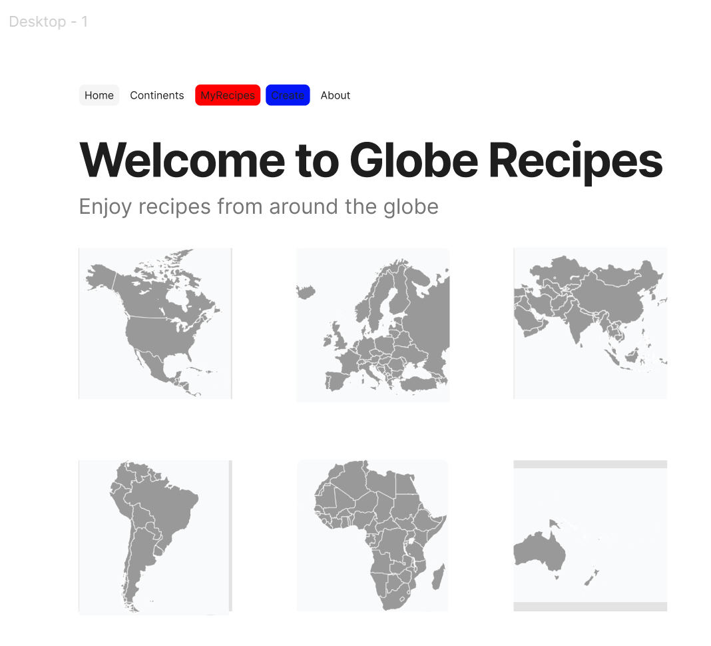
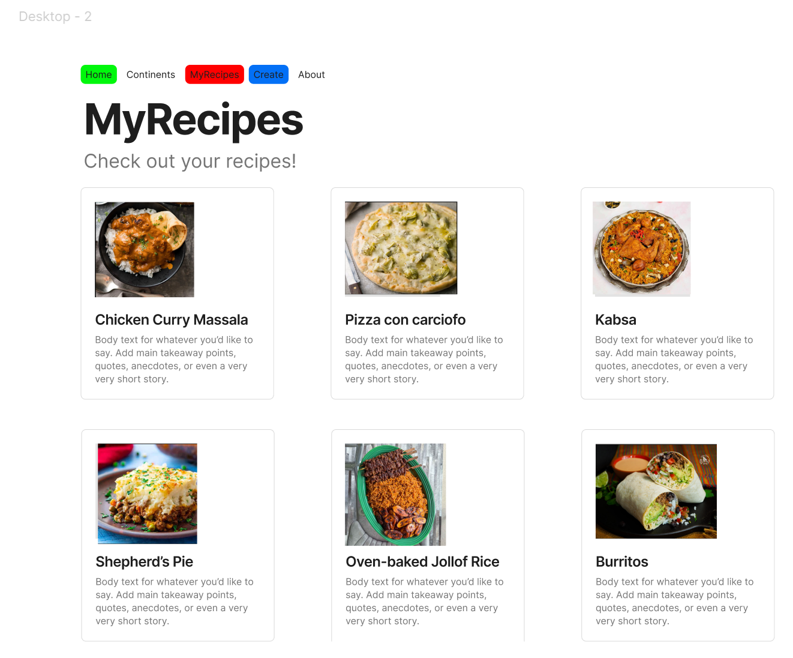
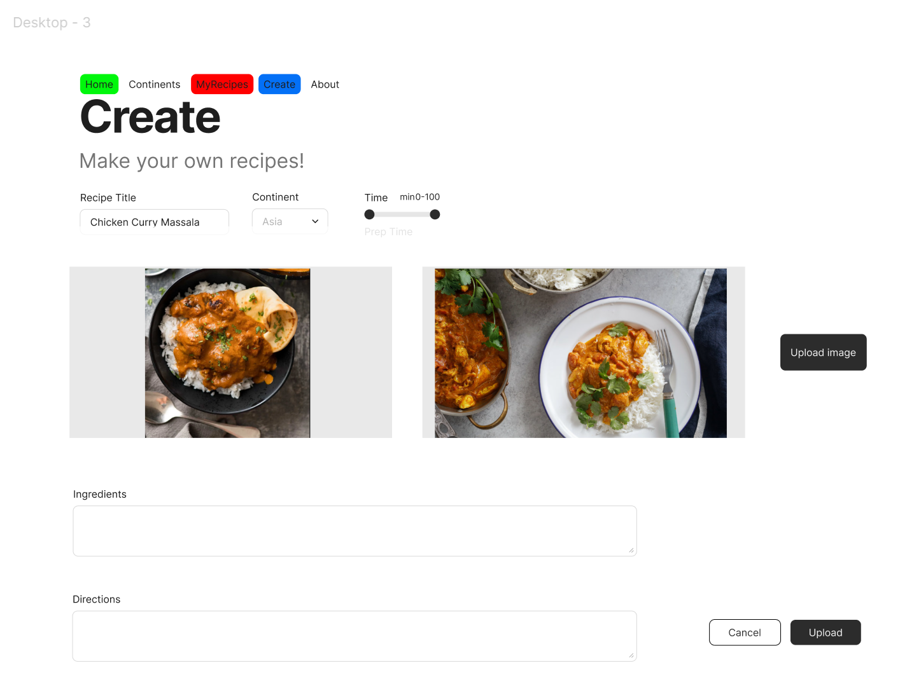
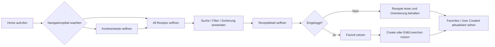
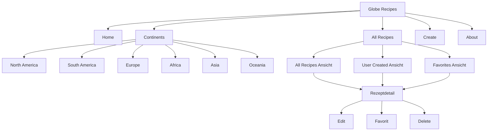

# Projektdokumentation - [Projekttitel]

## Inhaltsverzeichnis

1. [Ausgangslage](#1-ausgangslage)
2. [Lösungsidee](#2-lösungsidee)
3. [Vorgehen & Artefakte](#3-vorgehen--artefakte)
    1. [Understand & Define](#31-understand--define)
    2. [Sketch](#32-sketch)
    3. [Decide](#33-decide)
    4. [Prototype](#34-prototype)
    5. [Validate](#35-validate)
4. [Erweiterungen [Optional]](#4-erweiterungen-optional)
5. [Projektorganisation [Optional]](#5-projektorganisation-optional)
6. [KI-Deklaration](#6-ki-deklaration)
7. [Anhang [Optional]](#7-anhang-optional)

> **Hinweis:** Massgeblich sind die im **Unterricht** und auf **Moodle** kommunizierten Anforderungen.

<!-- WICHTIG: DIE KAPITELSTRUKTUR DARF NICHT VERÄNDERT WERDEN! -->

<!-- Diese Vorlage ist für eine README.md im Repository gedacht. Abschnitte mit [Optional] können weggelassen werden, wenn in den Übungen nichts anderes verlangt wird. -->

## 1. Ausgangslage <!--DONE-->
<!-- Kurz beschreiben, welches Problem adressiert wird und welches Ergebnis angestrebt ist. Wem nützt die Lösung, wer ist beteiligt oder betroffen? -->
- **Problem:** Viele Menschen interessieren sich fuer internationale Kuechen, finden aber alltagsnah oft nur verstreute, uneinheitliche oder schwer vergleichbare Rezeptinformationen. Gleichzeitig fehlen in bestehenden Sammlungen haeufig eine klare thematische Navigation (z. B. nach Kontinenten), ein einfacher Zugang zu Rezeptdetails und die Moeglichkeit, eigene Rezepte strukturiert zu erfassen und wiederzufinden. Dadurch entsteht ein Bruch zwischen Inspiration und praktischer Umsetzung beim Kochen.  
- **Ziele:**  
  - Eine uebersichtliche, responsive Webanwendung bereitstellen, die Rezepte ueber Kontinente hinweg strukturiert zugaenglich macht.  
  - Nutzer:innen ermoeglichen, eigene Rezepte zu erstellen, zu verwalten und wieder zu loeschen.  
  - Eine intuitive Navigation zwischen Inspirationsansicht (Kontinente), Gesamtliste und Detailansicht schaffen.  
  - Mit Login- und Favoritenfunktion einen persoenlichen Nutzen und wiederkehrende Nutzung unterstuetzen.  
  - Eine solide technische Basis mit SvelteKit, Bootstrap und MongoDB fuer weitere Erweiterungen schaffen.  
- **Primaere Zielgruppe:** Kochinteressierte Nutzer:innen, insbesondere Studierende und junge Erwachsene, die schnell internationale Gerichte entdecken, vergleichen und teilweise selbst kuratieren wollen.  
<!-- - **Weitere Stakeholder [Optional]:** Dozierende und Mitstudierende im Modul Prototyping (Feedback, Evaluation, Bewertung) sowie Testnutzer:innen, die Usability-Rueckmeldungen liefern. -->  

## 2. Loesungsidee
<!-- Beschreibt die Lösungsidee. -->
- **Kernfunktionalitaet:**
  - **Version 1 (ausformuliert):**
    1. **Entdecken ueber die Startseite und Kontinente:** Nutzer:innen starten auf der Home-Seite mit sechs Kontinent-Kacheln und gelangen von dort in kontinent-spezifische Seiten. Jede Kontinentseite bietet Einordnungstexte, Bilder und einen Carousel-Bereich, um kulinarische Kontexte schnell erfassbar zu machen.
    2. **Navigation zwischen Kontinenten und Hauptbereichen:** Ueber die globale Navigation (inkl. Continents-Dropdown) kann zwischen Home, Kontinenten, Create, All Recipes und About gewechselt werden. Dadurch ist sowohl exploratives Browsing als auch zielgerichtete Suche moeglich.
    3. **Rezepte als Gesamtliste nutzen:** In All Recipes werden alle vorhandenen Rezepte tabellarisch angezeigt. Die Spalten (z. B. Titel, Kontinent, Difficulty, Cooking Time) sind sortierbar, damit Nutzer:innen Rezepte schnell nach relevanten Kriterien ordnen koennen.
    4. **Direkter Detailzugriff aus der Liste:** Die Rezeptzeilen sind weitgehend klickbar und fuehren in die jeweilige Detailansicht. Dort werden Beschreibung, Metadaten, Zutaten, Schritte, Quelle/Ersteller sowie Favoritenstatus angezeigt.
    5. **Kontobezogene Nutzung (Sign-up/Login):** Nutzer:innen koennen ein Konto erstellen und sich einloggen. Die Sitzung wird serverseitig ueber Sessions verwaltet, damit geschuetzte Funktionen nur authentifizierten Nutzer:innen zur Verfuegung stehen.
    6. **Eigene Rezepte erstellen:** Auf der Create-Seite koennen eingeloggte Nutzer:innen Rezepte mit validierten Eingaben erstellen (u. a. Titel, Kontinent, Land, Beschreibung, Zutaten, Anweisungen, Difficulty, Zeit, Portionen). Ingredients und Instructions werden strukturiert als Liste erfasst.
    7. **Eigene Inhalte verwalten:** User-created Rezepte erscheinen in der Gesamtliste und in der Unteransicht User Created. Eigene Rezepte koennen geloescht werden; das Loeschen ist auf den/die jeweilige:n Owner:in beschraenkt.
    8. **Eigene Rezepte bearbeiten (Edit):** Fuer eigene (user-created) Rezepte steht eine Bearbeitungsansicht zur Verfuegung. Eingeloggte Owner koennen bestehende Inhalte aktualisieren, ohne ein Rezept neu anlegen zu muessen.
    9. **Suchen und filtern in All Recipes:** Die Rezeptliste bietet eine Suchfunktion sowie facettierte Filter (z. B. Kontinent, Schwierigkeitsgrad und Kochzeitbereich). Ergebnisse werden nach dem Anwenden der Filter gezielt eingegrenzt.
    10. **Favoriten verwalten:** Rezepte koennen ueber das Sternsymbol als Favorit markiert bzw. entmarkiert werden (Liste und Detailseite). Favoriten werden persistent in MongoDB gespeichert und in der Unteransicht Favorites gefiltert dargestellt.
    11. **Mehrere Rezeptansichten als Workflow:** In All Recipes koennen Nutzer:innen zwischen drei Ansichten wechseln: All Recipes, User Created und Favorites. So wird zwischen Entdecken, eigenen Inhalten und persoenlicher Kuratierung sauber getrennt.
    12. **Deploybare Webanwendung:** Das Projekt ist fuer Netlify-Deployment vorbereitet, sodass die Workflows nicht nur lokal, sondern als veroeffentlichter Web-Prototyp genutzt und validiert werden koennen.

  - **Version 2 (kurz genannt):**
    - Kontinente entdecken (Home-Kacheln + Kontinentseiten mit Carousel).
    - Global navigieren (Navbar + Continents-Dropdown).
    - Alle Rezepte tabellarisch anzeigen und sortieren.
    - In Rezept-Detailseiten wechseln und Inhalte lesen.
    - Konto erstellen, einloggen, Session nutzen.
    - Eigene Rezepte erstellen (validierte Formulareingaben).
    - Eigene Rezepte in separater Ansicht sehen, bearbeiten und loeschen (owner-basiert).
    - Rezepte ueber Suche und facettierte Filter eingrenzen (Kontinent, Difficulty, Kochzeitbereich).
    - Favoriten per Stern setzen/entfernen (persistent in MongoDB).
    - Zwischen All Recipes, User Created und Favorites wechseln.

  - **Workflow-Illustration (Mermaid):**
  - **Gesamtworkflow (Navigation + Kernnutzung):** Diese Darstellung zeigt den typischen Hauptpfad von der Startseite ueber Kontinente und All Recipes bis zur Detailansicht inklusive Suche/Filter, Sortierung und Favoriteninteraktion.

  - **Auth- und Owner-Workflow (Create/Edit/Delete):** Dieser Block zeigt, wie geschuetzte Aktionen ueber Login/Session abgesichert sind und dass Bearbeiten/Loeschen nur fuer eigene (owner-basierte) Rezepte erlaubt ist.

  - **Favoriten-Workflow:** Diese Darstellung beschreibt den Ablauf des Favoriten-Toggles (Liste/Detailseite), die Pruefung auf eingeloggte Nutzer:innen und die persistente Speicherung in MongoDB mit Ausgabe in der Favorites-Ansicht.

- **Annahmen [Optional]:**
  - Nutzer:innen moechten internationale Rezepte nicht nur lesen, sondern auch persoenlich sammeln (Favoriten) und eigene Inhalte beisteuern.
  - Eine kontinent-basierte Struktur erleichtert den Einstieg besser als eine rein lange, ungefilterte Rezeptliste.
  - Sortierbarkeit in der Tabelle ist fuer den ersten Prototyp nutzbringender als komplexe Filter- oder Suchlogik.
  - Ein einfacher Account-Flow (Sign-up/Login) reicht fuer den Prototyp aus, um geschuetzte User-Flows realistisch zu testen.
  - Persistenz in MongoDB ist notwendig, damit Inhalte und Favoriten ueber Sessions und Deployments hinweg stabil verfuegbar bleiben.

- **Abgrenzung [Optional]:**
  - Kein Image-Upload fuer eigene Rezepte (weder im Create-Formular noch in der Detailansicht).
  - Keine erweiterten Rollen/Rechte (z. B. Admin-Backoffice, Moderation, Freigabeworkflow).
  - Kein Passwort-Reset, keine E-Mail-Verifikation und kein Social Login.
  - Keine Mengenumrechnung, kein Einkaufslisten-Export, keine Naehrwertberechnung.
  - Kein Offline-Modus und keine native Mobile-App.

## 3. Vorgehen & Artefakte
Die Durchführung erfolgt phasenbasiert; dokumentieren Sie die wichtigsten Ergebnisse je Phase.

### 3.1 Understand & Define
- **Zielgruppenverständnis:**
  - **Problemraumanalyse (kurz):** In der Analysephase wurde deutlich, dass viele Rezeptplattformen entweder sehr viele Inhalte ohne klare Struktur bieten oder kaum Moeglichkeit zur persoenlichen Organisation geben. Fuer Globe Recipes wurde deshalb ein nutzerzentrierter Fokus auf Orientierung (Kontinente), persoenliche Kuratierung (Favoriten) und aktive Mitgestaltung (eigene Rezepte) gesetzt.
  - **Methodischer Ansatz (Understand/Define):** Angelehnt an Human-Centered Design wurden Zielgruppe, Nutzungskontext, Aufgaben und Frustpunkte zuerst hypothetisch ueber Proto-Personas beschrieben und danach in konkrete Produktanforderungen uebersetzt (Navigation, Listenansichten, Authentifizierung, Create/Edit/Delete, Such- und Filterlogik).
  - **Proto-Personas:**

      | Proto-Persona 1: | Lena, Hobbykoechin |
      |---|---|
      | **Persoenliche Attribute** | 25 Jahre, Studentin, digital affin, kocht 3-4x pro Woche |
      | **Umfeld** | Kocht zuhause mit Smartphone/Laptop, meist abends, begrenztes Budget |
      | **Ziele** | Neue internationale Rezepte entdecken; abwechslungsreich kochen; Rezepte schnell vergleichen |
      | **Aufgaben** | Nach Kontinent/Thema browsen; Rezeptdetails lesen; Favoriten speichern fuer spaeter |
      | **Frustpunkte** | Immer gleiche Vorschlaege auf grossen Plattformen; unuebersichtliche Trefferlisten; zu viel Werbung/Noise |

      | Proto-Persona 2: | Marco, Food Explorer |
      |---|---|
      | **Persoenliche Attribute** | 32 Jahre, berufstaetig, wenig Zeit unter der Woche, neugierig auf neue Kuechen |
      | **Umfeld** | Kocht hauptsaechlich am Wochenende, nutzt vor allem Mobile, sucht schnell Inspiration |
      | **Ziele** | In kurzer Zeit passende Rezepte finden; nach Schwierigkeitsgrad/Kochzeit filtern; Favoritenliste aufbauen |
      | **Aufgaben** | All-Recipes-Liste nutzen; sortieren/filtern; in Detailseiten wechseln und Rezepte speichern |
      | **Frustpunkte** | Zu viele Optionen ohne Fokus; fehlende Filterbarkeit; schwer nachvollziehbare Rezeptqualitaet |

      | Proto-Persona 3: | Sara, Familienmanagerin |
      |---|---|
      | **Persoenliche Attribute** | 40 Jahre, Mutter, organisiert Mahlzeiten fuer Familie, praxisorientiert |
      | **Umfeld** | Plant mehrere Gerichte pro Woche, nutzt Tablet/Notebook zuhause |
      | **Ziele** | Strukturierte Sammlung verlaesslicher Rezepte; einfache Wiederauffindbarkeit; eigene Rezepte dokumentieren |
      | **Aufgaben** | Eigene Rezepte erstellen/bearbeiten; in User-Created verwalten; nicht mehr benoetigte Rezepte loeschen |
      | **Frustpunkte** | Rezepte gehen in Notizen/Chats verloren; keine zentrale, persoenliche Verwaltung; hoher Suchaufwand |

- **Wesentliche Erkenntnisse:**
  - **Informationsarchitektur ist zentral:** Eine kontinentbasierte Navigation senkt die Einstiegshuerde und macht Discovery greifbarer als eine rein lineare Gesamtliste.
  - **Persoenlicher Mehrwert entscheidet ueber Wiederkehr:** Favoritenfunktion und persoenliche Rezeptverwaltung (Create/Edit/Delete) sind fuer langfristige Nutzung wichtiger als reine Lesefunktion.
  - **Effizienz im Browse-Prozess:** Suchfunktion sowie facettierte Filter (Kontinent, Difficulty, Kochzeitbereich) reduzieren Reibung und beschleunigen die Rezeptauswahl deutlich.
  - **Klare Berechtigungslogik schafft Vertrauen:** Owner-basierte Aktionen bei Bearbeiten/Loeschen verhindern ungewollte Eingriffe in fremde Inhalte.
  - **Mobile-First Relevanz:** Zielgruppen nutzen die App oft auf kleineren Screens; deshalb waren responsive Navigation, klickbare Listenzeilen und kompakte Interaktionen entscheidend.
  - **Fruehe Hypothesen fuer Validate-Phase:** Getroffene Annahmen betreffen vor allem die Nuetzlichkeit der Kontinentstruktur, die Akzeptanz von Favoriten und den Nutzen von Such-/Filterlogik; diese sind in der Validate-Phase gezielt testbar.

### 3.2 Sketch
- **Variantenueberblick:**
   
  Ein erster, schneller Papier-Sketch wurde im Rahmen von Crazy 8 erstellt, um mehrere Loesungsansaetze in kurzer Zeit zu visualisieren; anschliessend wurden die vielversprechendsten Varianten in Figma als digitale Skizzen ausgearbeitet.

 

- **Skizzen: Crazy Eight (Papier-Sketch)**

  

  Der erste Entwurf wurde als schneller Papier-Sketch im Crazy-8-Stil erstellt. Ziel war es, in kurzer Zeit mehrere Layout- und Navigationsideen sichtbar zu machen (Home, Kontinentansicht, Rezeptdetail und Create-Flow), ohne frueh in visuelle Details zu investieren.

 

- **Skizzen in Figma**

  

  **Erstes Bild:** Fokus auf der Home-Page mit klarer Navigation und Kontinent-Kacheln. Diese Richtung liegt nahe an der aktuell umgesetzten Startseite und wurde deshalb als solide Basis fuer die weitere Ausarbeitung genutzt.

   

  

  **Zweites Bild:** Rezept-Uebersicht als Kachelgrid mit grossen Bildern. Der Ansatz war visuell attraktiv, wurde aber als relativ aufwaendig beurteilt (Bildpflege, Konsistenz und Content-Aufbereitung) und daher nicht als primaere Listenlogik weiterverfolgt.

   

  

  **Drittes Bild:** "Bare-bones"-Variante der Create-Page mit Fokus auf Eingabefluss und Formularlogik. Diese Skizze half, die benoetigten Felder frueh zu strukturieren und die spaetere Umsetzungsprioritaet auf funktionale Klarheit statt reine Optik zu legen.

   

### 3.3 Decide
- **Gewaehlte Variante & Begruendung:**  
  - Es wurde bewusst ein **Mischansatz** aus den erarbeiteten Varianten verwendet: Teile aus den Papier-/Figma-Skizzen wurden uebernommen, andere Teile waehrend der Umsetzung direkt im Projekt durch iteratives Ausprobieren und Prompting weiterentwickelt.
  - Die finale Richtung kombiniert daher fruehe Entwurfsideen (z. B. kontinentbasierte Orientierung und klare Hauptnavigation) mit pragmatischen Entscheidungen aus der Implementierungsphase.
  - Die Variante "Rezeptliste als Kacheln mit grossen Bildern" wurde nicht als Hauptdarstellung umgesetzt, da Erstellung/Pflege geeigneter Bilder sowie konsistente Bildqualitaet einen deutlich hoeheren Aufwand verursacht haetten.
  - **Entscheidungskriterien im Projekt:**
    - **Nutzbarkeit zuerst:** schnelle Orientierung, klarer Ablauf, wenige Klicks bis zur Rezeptdetailseite.
    - **Umsetzbarkeit im Modulrahmen:** Fokus auf stabile Kernfunktionen statt aufwendige Medienproduktion.
    - **Wartbarkeit:** strukturierte Listen-, Filter- und CRUD-Logik sind leichter erweiterbar als bildlastige Sonderlayouts.
    - **Technische Konsistenz:** gleiche Interaktionsmuster in Navigation, Listenansichten und Detailseiten.

- **End-to-End-Ablauf:**  
  - Der Ablauf wurde als task-orientierte User Journey (Happy Flow) definiert, im Sinn von "konkrete Aufgabenerledigung mit dem Produkt":
    1. **Einstieg & Orientierung:** Home-Page oeffnen und ueber Navbar/Kontinent-Kacheln in die gewuenschte Richtung navigieren.
    2. **Entdecken & Eingrenzen:** In All Recipes Rezepte durchsuchen, filtern und sortieren.
    3. **Bewerten & Entscheiden:** Rezeptdetailseite aufrufen, Zutaten/Anleitung/Metadaten pruefen, ggf. Favorit setzen.
    4. **Eigene Inhalte verwalten:** (eingeloggt) Rezept erstellen, in User Created wiederfinden, bearbeiten oder loeschen.
    5. **Persoenliche Kuratierung:** Favoriten in der Favorites-Ansicht gebuendelt nutzen.
  - **User Journey (Happy Flow als Ablaufgrafik):**

  _Diese User Journey zeigt den zentralen Happy Flow vom Einstieg ueber Auswahl und Bewertung bis zur persoenlichen Kuratierung._

  - **Informationsarchitektur (Hierarchie + Navigation):**

  _Die Hierarchie zeigt die Seitenstruktur (oben) und die wichtigsten Navigationswege in die Rezeptdetail- und Verwaltungsfunktionen (unten)._

- **Mockup:**  
  - Referenz auf die bereits dokumentierten Entwurfsstaende in **Kapitel 3.2 Sketch** (Crazy Eight + Figma-Screens 1-3).
  - **Figma-Link (Platzhalter):** `[Figma-Referenz-Mockup hier einfuegen](PASTE_FIGMA_LINK_HERE)`
  - **Einordnung der Figma-Screens im Vergleich zum aktuellen Projektstand:**
    - **Figma Screen 1 (Home):** Grundidee (Navigation + Kontinentfokus) wurde weitgehend uebernommen und entspricht der aktuellen Startlogik.
    - **Figma Screen 2 (MyRecipes als Kachelansicht):** visuelle Richtung wurde nur teilweise uebernommen; aktuell liegt der Fokus auf einer funktionalen Tabellen-/Listenlogik in All Recipes mit Sortierung, Filtern und Aktionen.
    - **Figma Screen 3 (Create):** die "bare-bones"-Formularidee wurde inhaltlich uebernommen; im aktuellen Stand ist die Create-Seite technisch erweitert (Validierung, strukturierte Eingaben, Login-Schutz).

### 3.4 Prototype

#### 3.4.1. Entwurf (Design)
Beschreibt die Gestaltung und Interaktion.
> **Hinweis:** Hier wird der **Prototyp** beschrieben, nicht das **Mockup**.
- **Informationsarchitektur:** _[z. B. Seiten/Navigation: Konzept, nicht die technische Umsetzung]_
- **User Interface Design:** _[wichtige Screens: Screenshots mit kurzen Erläuterungen]_  
- **Designentscheidungen:** _[zentrale Entscheidungen und Begründungen]_

#### 3.4.2. Umsetzung (Technik)
Fasst die technische Realisierung zusammen.
- **Technologie-Stack:** _[SvelteKit, Bibliotheken falls genutzt]_
- **Tooling:** _[IDE/Erweiterungen, lokale/Cloud-Tools; den Einsatz von KI beschreiben Sie im Kapitel **KI-Deklaration**]_  
- **Struktur & Komponenten:** _[Seiten, Routen, State/Stores, wichtige Komponenten]_
- **Daten & Schnittstellen:** _[Wie werden Daten gespeichert, verwaltet, abgerufen?]_
- **Deployment:** _[URL]_  
- **Besondere Entscheidungen:** _[z. B. Trade-offs, Vereinfachungen]_  

### 3.5 Validate
- **URL der getesteten Version** (separat deployt)
- **Ziele der Prüfung:** _[welche Fragen sollen beantwortet werden?]_  
- **Vorgehen:** _[moderiert/unmoderiert; remote/on-site]_  
- **Stichprobe:** _[Mit wem wurde getestet? Profil; Anzahl]_  
- **Aufgaben/Szenarien:** _[Ausformulierte Testaufgaben]_  
- **Kennzahlen & Beobachtungen:** _[z. B. Erfolgsquote, Zeitbedarf, qualitative Findings]_  
- **Zusammenfassung der Resultate:** _[Wichtigste Erkenntnisse; 2-4 Sätze]_  
- **Abgeleitete Verbesserungen:** _[Anforderungen, die als nächstes umgesetzt werden sollten, priorisiert, kurz begründet; falls Verbesserungen im Prototyp konkret umgesetzt wurden: In Kap. 4 dokumentieren]_  

## 4. Erweiterungen [Optional]
Dokumentiert Erweiterungen über den Mindestumfang hinaus.
> **Hinweis:** Jede Erweiterung ist separat nach dem folgenden Schema zu beschreiben.

### _[4.x Kurzbeschreibung / Titel]_  
- **Beschreibung & Nutzen:** _[Was wurde erweitert? Warum?]_  
- **Wo umgesetzt:** _[Wie und wo wurde es gemacht? Frontend, Backend, Datenbank?]_  
- **Referenz:** _[Wo wird die Erweiterung auch noch beschrieben, z.B. Screenshot oder Beschreibung in einem anderen Kapitel]_  
- **Aus Evaluation abgeleitet?:** _[Wurde diese Erweiterung als Folge eines in der Evaluation identifizierten Issues implementiert?]_  

> Das folgende **Beispiel** wurde bewusst kurz gehalten. Erweiterungen dürfen auch ausführlicher beschrieben werden.

### 4.1 Tabelle nach Kategorien filtern
- **Beschreibung & Nutzen:** Tabelle X kann nach Kategorie gefiltert werden, weil User typischerweise nur an einer bestimmten Kategorie interessiert sind.  
- **Wo umgesetzt:** 
  - **Frontend:** Tabelle mit Dropdown in Datei ...
  - **Backend:** Form Action ... in Datei ...
  - **Datenbank:** MongoDB-Query in Datei ...
- **Referenz:** Screenshot in Kap. x.y
- **Aus Evaluation abgeleitet?:** Ja, Issue x.y

## 5. Projektorganisation [Optional]
Beispiele:
- **Repository & Struktur:** _[Link; kurze Strukturübersicht]_  
- **Issue-Management:** _[Vorgehen kurz beschreiben]_  
- **Commit-Praxis:** _[z. B. sprechende Commits]_

## 6. KI-Deklaration
Die folgende Deklaration ist verpflichtend und beschreibt den Einsatz von KI im Projekt.

### 6.1 KI-Tools
- **Eingesetzte Tools**: _[z. B. Copilot, ChatGPT, Claude, lokale Modelle; Version/Variante wenn bekannt]_
- **Zweck & Umfang**: _[wie, wofür und in welchem Ausmass wurde KI eingesetzt (z. B. Textentwürfe, Codevorschläge, Tests, Refactoring); welche Teile stammen (ganz/teilweise) aus KI-Unterstützung?]_
- **Eigene Leistung (Abgrenzung):** _[was ist eigenständig erarbeitet/überarbeitet worden?]_

### 6.2 Prompt-Vorgehen
_[Überlegungen zu Prompt-Vorgehen, Qualität und Urheberrecht/Quellen. Wie wurde beim Prompting vorgegangen? Zu beschreiben ist die grundlegende Vorgehensweise. Einzelne, konkrete Prompts sollten höchstens als Beispiele aufgeführt werden. ]_

### 6.3 Reflexion
_[Nutzen, Grenzen, Risiken/Qualitätssicherung, ...]_

## 7. Anhang [Optional]
Beispiele:
- **Quellen:** _[verwendete Vorlagen/Assets/Modelle; Lizenz/Urheberrecht; ...]_
- **Testskript & Materialien:** _[Link/Datei]_  
- **Rohdaten/Auswertung:** _[Link/Datei]_  

