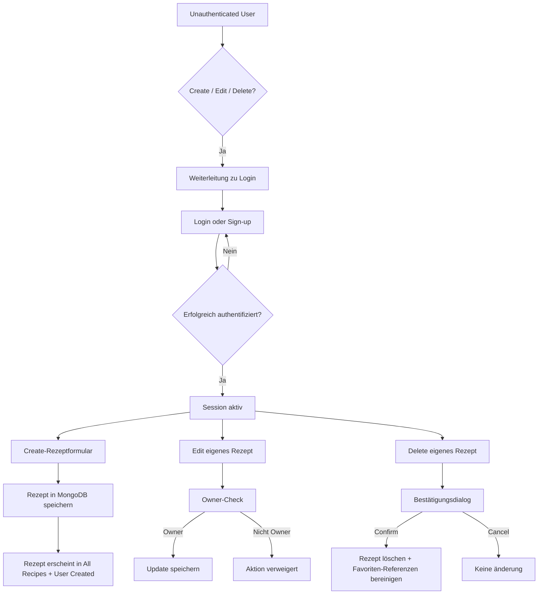
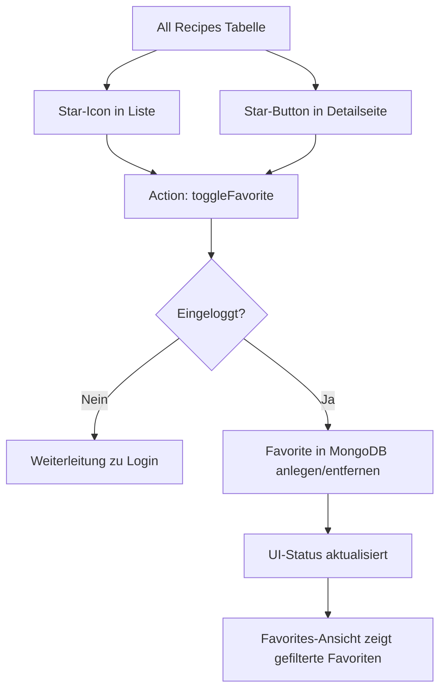
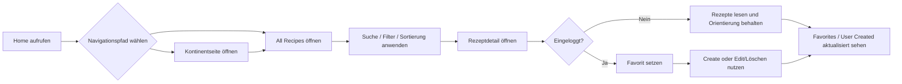
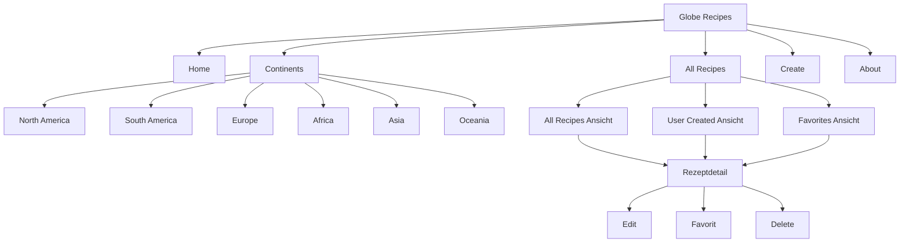

# Projektdokumentation - [Projekttitel]

## Inhaltsverzeichnis

1. [Ausgangslage](#1-ausgangslage)
2. [Lösungsidee](#2-lösungsidee)
3. [Vorgehen & Artefakte](#3-vorgehen--artefakte)
    1. [Understand & Define](#31-understand--define)
    2. [Sketch](#32-sketch)
    3. [Decide](#33-decide)
    4. [Prototype](#34-prototype)
    5. [Validate](#35-validate)
4. [Erweiterungen [Optional]](#4-erweiterungen-optional)
5. [Projektorganisation [Optional]](#5-projektorganisation-optional)
6. [KI-Deklaration](#6-ki-deklaration)
7. [Anhang [Optional]](#7-anhang-optional)

> **Hinweis:** Massgeblich sind die im **Unterricht** und auf **Moodle** kommunizierten Anforderungen.

<!-- WICHTIG: DIE KAPITELSTRUKTUR DARF NICHT VERÄNDERT WERDEN! -->

<!-- Diese Vorlage ist für eine README.md im Repository gedacht. Abschnitte mit [Optional] können weggelassen werden, wenn in den Übungen nichts anderes verlangt wird. -->

## 1. Ausgangslage <!--DONE-->
<!-- Kurz beschreiben, welches Problem adressiert wird und welches Ergebnis angestrebt ist. Wem nützt die Lösung, wer ist beteiligt oder betroffen? -->
- **Problem:** Viele Menschen interessieren sich für internationale Küchen, finden aber alltagsnah oft nur verstreute, uneinheitliche oder schwer vergleichbare Rezeptinformationen. Gleichzeitig fehlen in bestehenden Sammlungen häufig eine klare thematische Navigation (z. B. nach Kontinenten), ein einfacher Zugang zu Rezeptdetails und die Möglichkeit, eigene Rezepte strukturiert zu erfassen und wiederzufinden. Dadurch entsteht ein Bruch zwischen Inspiration und praktischer Umsetzung beim Kochen.  
- **Ziele:**  
  - Eine übersichtliche, responsive Webanwendung bereitstellen, die Rezepte über Kontinente hinweg strukturiert zugänglich macht.  
  - Nutzer:innen ermöglichen, eigene Rezepte zu erstellen, zu verwalten und wieder zu löschen.  
  - Eine intuitive Navigation zwischen Inspirationsansicht (Kontinente), Gesamtliste und Detailansicht schaffen.  
  - Mit Login- und Favoritenfunktion einen persönlichen Nutzen und wiederkehrende Nutzung unterstützen.  
  - Eine solide technische Basis mit SvelteKit, Bootstrap und MongoDB für weitere Erweiterungen schaffen.  
- **Primäre Zielgruppe:** Kochinteressierte Nutzer:innen, insbesondere Studierende und junge Erwachsene, die schnell internationale Gerichte entdecken, vergleichen und teilweise selbst kuratieren wollen.  
<!-- - **Weitere Stakeholder [Optional]:** Dozierende und Mitstudierende im Modul Prototyping (Feedback, Evaluation, Bewertung) sowie Testnutzer:innen, die Usability-Rückmeldungen liefern. -->  

## 2. Lösungsidee
<!-- Beschreibt die Lösungsidee. -->
- **Kernfunktionalität:**
  - **Version 1 (ausformuliert):**
    1. **Entdecken über die Startseite und Kontinente:** Nutzer:innen starten auf der Home-Seite mit sechs Kontinent-Kacheln und gelangen von dort in kontinent-spezifische Seiten. Jede Kontinentseite bietet Einordnungstexte, Bilder und einen Carousel-Bereich, um kulinarische Kontexte schnell erfassbar zu machen.
    2. **Navigation zwischen Kontinenten und Hauptbereichen:** über die globale Navigation (inkl. Continents-Dropdown) kann zwischen Home, Kontinenten, Create, All Recipes und About gewechselt werden. Dadurch ist sowohl exploratives Browsing als auch zielgerichtete Suche möglich.
    3. **Rezepte als Gesamtliste nutzen:** In All Recipes werden alle vorhandenen Rezepte tabellarisch angezeigt. Die Spalten (z. B. Titel, Kontinent, Difficulty, Cooking Time) sind sortierbar, damit Nutzer:innen Rezepte schnell nach relevanten Kriterien ordnen können.
    4. **Direkter Detailzugriff aus der Liste:** Die Rezeptzeilen sind weitgehend klickbar und führen in die jeweilige Detailansicht. Dort werden Beschreibung, Metadaten, Zutaten, Schritte, Qülle/Ersteller sowie Favoritenstatus angezeigt.
    5. **Kontobezogene Nutzung (Sign-up/Login):** Nutzer:innen können ein Konto erstellen und sich einloggen. Die Sitzung wird serverseitig über Sessions verwaltet, damit geschützte Funktionen nur authentifizierten Nutzer:innen zur Verfügung stehen.
    6. **Eigene Rezepte erstellen:** Auf der Create-Seite können eingeloggte Nutzer:innen Rezepte mit validierten Eingaben erstellen (u. a. Titel, Kontinent, Land, Beschreibung, Zutaten, Anweisungen, Difficulty, Zeit, Portionen). Ingredients und Instructions werden strukturiert als Liste erfasst.
    7. **Eigene Inhalte verwalten:** User-created Rezepte erscheinen in der Gesamtliste und in der Unteransicht User Created. Eigene Rezepte können gelöscht werden; das Löschen ist auf den/die jeweilige:n Owner:in beschränkt.
    8. **Eigene Rezepte bearbeiten (Edit):** Für eigene (user-created) Rezepte steht eine Bearbeitungsansicht zur Verfügung. Eingeloggte Owner können bestehende Inhalte aktualisieren, ohne ein Rezept neu anlegen zu müssen.
    9. **Suchen und filtern in All Recipes:** Die Rezeptliste bietet eine Suchfunktion sowie facettierte Filter (z. B. Kontinent, Schwierigkeitsgrad und Kochzeitbereich). Ergebnisse werden nach dem Anwenden der Filter gezielt eingegrenzt.
    10. **Favoriten verwalten:** Rezepte können über das Sternsymbol als Favorit markiert bzw. entmarkiert werden (Liste und Detailseite). Favoriten werden persistent in MongoDB gespeichert und in der Unteransicht Favorites gefiltert dargestellt.
    11. **Mehrere Rezeptansichten als Workflow:** In All Recipes können Nutzer:innen zwischen drei Ansichten wechseln: All Recipes, User Created und Favorites. So wird zwischen Entdecken, eigenen Inhalten und persönlicher Kuratierung sauber getrennt.
    12. **Deploybare Webanwendung:** Das Projekt ist für Netlify-Deployment vorbereitet, sodass die Workflows nicht nur lokal, sondern als veröffentlichter Web-Prototyp genutzt und validiert werden können.

  - **Version 2 (kurz genannt):**
    - Kontinente entdecken (Home-Kacheln + Kontinentseiten mit Carousel).
    - Global navigieren (Navbar + Continents-Dropdown).
    - Alle Rezepte tabellarisch anzeigen und sortieren.
    - In Rezept-Detailseiten wechseln und Inhalte lesen.
    - Konto erstellen, einloggen, Session nutzen.
    - Eigene Rezepte erstellen (validierte Formulareingaben).
    - Eigene Rezepte in separater Ansicht sehen, bearbeiten und löschen (owner-basiert).
    - Rezepte über Suche und facettierte Filter eingrenzen (Kontinent, Difficulty, Kochzeitbereich).
    - Favoriten per Stern setzen/entfernen (persistent in MongoDB).
    - Zwischen All Recipes, User Created und Favorites wechseln.

  - **Workflow-Illustration (Mermaid):**
  - **Gesamtworkflow (Navigation + Kernnutzung):** Diese Darstellung zeigt den typischen Hauptpfad von der Startseite über Kontinente und All Recipes bis zur Detailansicht inklusive Suche/Filter, Sortierung und Favoriteninteraktion.

  - **Auth- und Owner-Workflow (Create/Edit/Delete):** Dieser Block zeigt, wie geschützte Aktionen über Login/Session abgesichert sind und dass Bearbeiten/Löschen nur für eigene (owner-basierte) Rezepte erlaubt ist.

  - **Favoriten-Workflow:** Diese Darstellung beschreibt den Ablauf des Favoriten-Toggles (Liste/Detailseite), die Prüfung auf eingeloggte Nutzer:innen und die persistente Speicherung in MongoDB mit Ausgabe in der Favorites-Ansicht.

- **Annahmen [Optional]:**
  - Nutzer:innen möchten internationale Rezepte nicht nur lesen, sondern auch persönlich sammeln (Favoriten) und eigene Inhalte beisteürn.
  - Eine kontinent-basierte Struktur erleichtert den Einstieg besser als eine rein lange, ungefilterte Rezeptliste.
  - Sortierbarkeit in der Tabelle ist für den ersten Prototyp nutzbringender als komplexe Filter- oder Suchlogik.
  - Ein einfacher Account-Flow (Sign-up/Login) reicht für den Prototyp aus, um geschützte User-Flows realistisch zu testen.
  - Persistenz in MongoDB ist notwendig, damit Inhalte und Favoriten über Sessions und Deployments hinweg stabil verfügbar bleiben.

- **Abgrenzung [Optional]:**
  - Kein Image-Upload für eigene Rezepte (weder im Create-Formular noch in der Detailansicht).
  - Keine erweiterten Rollen/Rechte (z. B. Admin-Backoffice, Moderation, Freigabeworkflow).
  - Kein Passwort-Reset, keine E-Mail-Verifikation und kein Social Login.
  - Keine Mengenumrechnung, kein Einkaufslisten-Export, keine Nährwertberechnung.
  - Kein Offline-Modus und keine native Mobile-App.

## 3. Vorgehen & Artefakte
Die Durchführung erfolgt phasenbasiert; dokumentieren Sie die wichtigsten Ergebnisse je Phase.

### 3.1 Understand & Define
- **Zielgruppenverständnis:**
  - **Problemraumanalyse (kurz):** In der Analysephase wurde deutlich, dass viele Rezeptplattformen entweder sehr viele Inhalte ohne klare Struktur bieten oder kaum Möglichkeit zur persönlichen Organisation geben. Für Globe Recipes wurde deshalb ein nutzerzentrierter Fokus auf Orientierung (Kontinente), persönliche Kuratierung (Favoriten) und aktive Mitgestaltung (eigene Rezepte) gesetzt.
  - **Methodischer Ansatz (Understand/Define):** Angelehnt an Human-Centered Design wurden Zielgruppe, Nutzungskontext, Aufgaben und Frustpunkte zürst hypothetisch über Proto-Personas beschrieben und danach in konkrete Produktanforderungen übersetzt (Navigation, Listenansichten, Authentifizierung, Create/Edit/Delete, Such- und Filterlogik).
  - **Proto-Personas:**

      | Proto-Persona 1: | Lena, Hobbyköchin |
      |---|---|
      | **Persönliche Attribute** | 25 Jahre, Studentin, digital affin, kocht 3-4x pro Woche |
      | **Umfeld** | Kocht zuhause mit Smartphone/Laptop, meist abends, begrenztes Budget |
      | **Ziele** | Neü internationale Rezepte entdecken; abwechslungsreich kochen; Rezepte schnell vergleichen |
      | **Aufgaben** | Nach Kontinent/Thema browsen; Rezeptdetails lesen; Favoriten speichern für später |
      | **Frustpunkte** | Immer gleiche Vorschläge auf grossen Plattformen; unübersichtliche Trefferlisten; zu viel Werbung/Noise |

      | Proto-Persona 2: | Marco, Food Explorer |
      |---|---|
      | **Persönliche Attribute** | 32 Jahre, berufstätig, wenig Zeit unter der Woche, neugierig auf neü Küchen |
      | **Umfeld** | Kocht hauptsächlich am Wochenende, nutzt vor allem Mobile, sucht schnell Inspiration |
      | **Ziele** | In kurzer Zeit passende Rezepte finden; nach Schwierigkeitsgrad/Kochzeit filtern; Favoritenliste aufbaün |
      | **Aufgaben** | All-Recipes-Liste nutzen; sortieren/filtern; in Detailseiten wechseln und Rezepte speichern |
      | **Frustpunkte** | Zu viele Optionen ohne Fokus; fehlende Filterbarkeit; schwer nachvollziehbare Rezeptqualität |

      | Proto-Persona 3: | Sara, Familienmanagerin |
      |---|---|
      | **Persönliche Attribute** | 40 Jahre, Mutter, organisiert Mahlzeiten für Familie, praxisorientiert |
      | **Umfeld** | Plant mehrere Gerichte pro Woche, nutzt Tablet/Notebook zuhause |
      | **Ziele** | Strukturierte Sammlung verlässlicher Rezepte; einfache Wiederauffindbarkeit; eigene Rezepte dokumentieren |
      | **Aufgaben** | Eigene Rezepte erstellen/bearbeiten; in User-Created verwalten; nicht mehr benötigte Rezepte löschen |
      | **Frustpunkte** | Rezepte gehen in Notizen/Chats verloren; keine zentrale, persönliche Verwaltung; hoher Suchaufwand |

  - **User Journey Map 1: Rezept entdecken und favorisieren (wichtigster Browse-Flow)**

      |  | 1) Einstieg & Orientierung | 2) Entdecken & Eingrenzen | 3) Bewerten & Entscheiden | 4) Merken & Wiederfinden |
      |---|---|---|---|---|
      | **Ziel** | Schnell in den passenden Bereich gelangen | Relevante Rezepte mit wenig Aufwand finden | Passendes Rezept sicher auswählen | Rezept später gezielt wiederfinden |
      | **Aktionen** | Home öffnen -> Navbar/Kontinent wählen | All Recipes öffnen -> Suche, Filter, Sortierung nutzen | Detailseite öffnen -> Zutaten, Anleitung, Metadaten prüfen | Stern setzen -> in Favorites wechseln |
      | **Touchpoints** | Home, Navbar, Kontinent-Kacheln | All-Recipes-Tabelle, Suchfeld, Filter, Sortierung | Rezeptdetailseite | Star-Icon (Liste/Detail), Favorites-Ansicht |
      | **Emotion** | Orientierung, Neugier | Fokus, Effizienz | Sicherheit bei der Auswahl | Zufriedenheit, Kontrolle |
      | **Risiko** | Zu viele Einstiegsoptionen | Zu breite Trefferliste ohne Eingrenzung | Unsicherheit bei Rezeptqualität | Favorit nicht sofort sichtbar |
      | **Mitigation** | Klare Hauptnavigation und Kontinentstruktur | Suchfunktion + facettierte Filter + Sortierung | Strukturierte Detailansicht (Zutaten/Schritte/Metadaten) | Persistente Favoriten in MongoDB + eigene Favorites-Ansicht |

  _Diese Journey beschreibt den zentralen Nutzungsfall "Rezept finden, prüfen und für später merken" und deckt den häufigsten Happy Flow im Projekt ab._

  - **User Journey Map 2: Eigenes Rezept erstellen, bearbeiten und verwalten (Creator-Flow)**

      |  | 1) Login & Zugriff | 2) Rezept erstellen | 3) Bearbeiten/Verwalten | 4) Bereinigen/Abschließen |
      |---|---|---|---|---|
      | **Ziel** | Geschützte Funktionen sicher nutzen | Eigenes Rezept korrekt erfassen | Inhalte bei Bedarf anpassen | Nicht mehr benötigte Inhalte sauber entfernen |
      | **Aktionen** | Sign-up/Login durchführen | Create-Formular ausfüllen -> absenden | In User Created öffnen -> Edit ausführen -> speichern | Delete starten -> Bestätigungsdialog bestätigen/abbrechen |
      | **Touchpoints** | Login/Sign-up, Session-Handling | Create-Seite, Formularfelder, Submit | All Recipes (User Created), Detailseite, Edit-Ansicht | Delete-Button, Modal-Dialog, Tabellenansicht |
      | **Emotion** | Vertrauen, Zugang erhalten | Produktivität, Ownership | Kontrolle über eigene Inhalte | Klarheit und Sicherheit vor Löschaktion |
      | **Risiko** | Fehlgeschlagener Login blockiert Flow | Unvollständige oder fehlerhafte Eingaben | Unklare Berechtigungen bei Bearbeitung | Versehentliches Löschen |
      | **Mitigation** | Klare Fehlermeldungen, stabile Session-Logik | Validierung und strukturierte Eingabefelder | Owner-basierte Rechteprüfung für Edit/Delete | Zentrales Bestätigungsmodal mit Cancel/Confirm |

  _Diese Journey zeigt den wichtigsten Creator-Prozess von Authentifizierung bis Verwaltung eigener Rezepte und bildet die Kernlogik der geschützten CRUD-Funktionen ab._

- **Wesentliche Erkenntnisse:**
  - **Informationsarchitektur ist zentral:** Eine kontinentbasierte Navigation senkt die Einstiegshürde und macht Discovery greifbarer als eine rein lineare Gesamtliste.
  - **Persönlicher Mehrwert entscheidet über Wiederkehr:** Favoritenfunktion und persönliche Rezeptverwaltung (Create/Edit/Delete) sind für langfristige Nutzung wichtiger als reine Lesefunktion.
  - **Effizienz im Browse-Prozess:** Suchfunktion sowie facettierte Filter (Kontinent, Difficulty, Kochzeitbereich) reduzieren Reibung und beschleunigen die Rezeptauswahl deutlich.
  - **Klare Berechtigungslogik schafft Vertraün:** Owner-basierte Aktionen bei Bearbeiten/Löschen verhindern ungewollte Eingriffe in fremde Inhalte.
  - **Mobile-First Relevanz:** Zielgruppen nutzen die App oft auf kleineren Screens; deshalb waren responsive Navigation, klickbare Listenzeilen und kompakte Interaktionen entscheidend.
  - **Frühe Hypothesen für Validate-Phase:** Getroffene Annahmen betreffen vor allem die Nützlichkeit der Kontinentstruktur, die Akzeptanz von Favoriten und den Nutzen von Such-/Filterlogik; diese sind in der Validate-Phase gezielt testbar.

### 3.2 Sketch
- **Variantenüberblick:**
   
  Ein erster, schneller Papier-Sketch wurde im Rahmen von Crazy 8 erstellt, um mehrere Lösungsansätze in kurzer Zeit zu visualisieren; anschliessend wurden die vielversprechendsten Varianten in Figma als digitale Skizzen ausgearbeitet.

 

- **Skizzen: Crazy Eight (Papier-Sketch)**

  

  Der erste Entwurf wurde als schneller Papier-Sketch im Crazy-8-Stil erstellt. Ziel war es, in kurzer Zeit mehrere Layout- und Navigationsideen sichtbar zu machen (Home, Kontinentansicht, Rezeptdetail und Create-Flow), ohne früh in visülle Details zu investieren.

 

- **Skizzen in Figma**

  

  **Erstes Bild:** Fokus auf der Home-Page mit klarer Navigation und Kontinent-Kacheln. Diese Richtung liegt nahe an der aktüll umgesetzten Startseite und wurde deshalb als solide Basis für die weitere Ausarbeitung genutzt.

   

  

  **Zweites Bild:** Rezept-übersicht als Kachelgrid mit grossen Bildern. Der Ansatz war visüll attraktiv, wurde aber als relativ aufwändig beurteilt (Bildpflege, Konsistenz und Content-Aufbereitung) und daher nicht als primäre Listenlogik weiterverfolgt.

   

  

  **Drittes Bild:** "Bare-bones"-Variante der Create-Page mit Fokus auf Eingabefluss und Formularlogik. Diese Skizze half, die benötigten Felder früh zu strukturieren und die spätere Umsetzungspriorität auf funktionale Klarheit statt reine Optik zu legen.

   

### 3.3 Decide
- **Gewählte Variante & Begründung:**  
  - Es wurde bewusst ein **Mischansatz** aus den erarbeiteten Varianten verwendet: Teile aus den Papier-/Figma-Skizzen wurden übernommen, andere Teile während der Umsetzung direkt im Projekt durch iteratives Ausprobieren und Prompting weiterentwickelt.
  - Die finale Richtung kombiniert daher frühe Entwurfsideen (z. B. kontinentbasierte Orientierung und klare Hauptnavigation) mit pragmatischen Entscheidungen aus der Implementierungsphase.
  - Die Variante "Rezeptliste als Kacheln mit grossen Bildern" wurde nicht als Hauptdarstellung umgesetzt, da Erstellung/Pflege geeigneter Bilder sowie konsistente Bildqualität einen deutlich höheren Aufwand verursacht hätten.
  - **Entscheidungskriterien im Projekt:**
    - **Nutzbarkeit zürst:** schnelle Orientierung, klarer Ablauf, wenige Klicks bis zur Rezeptdetailseite.
    - **Umsetzbarkeit im Modulrahmen:** Fokus auf stabile Kernfunktionen statt aufwendige Medienproduktion.
    - **Wartbarkeit:** strukturierte Listen-, Filter- und CRUD-Logik sind leichter erweiterbar als bildlastige Sonderlayouts.
    - **Technische Konsistenz:** gleiche Interaktionsmuster in Navigation, Listenansichten und Detailseiten.

- **End-to-End-Ablauf:**  
  - Der Ablauf wurde als task-orientierte User Journey (Happy Flow) definiert, im Sinn von "konkrete Aufgabenerledigung mit dem Produkt":
    1. **Einstieg & Orientierung:** Home-Page öffnen und über Navbar/Kontinent-Kacheln in die gewünschte Richtung navigieren.
    2. **Entdecken & Eingrenzen:** In All Recipes Rezepte durchsuchen, filtern und sortieren.
    3. **Bewerten & Entscheiden:** Rezeptdetailseite aufrufen, Zutaten/Anleitung/Metadaten prüfen, ggf. Favorit setzen.
    4. **Eigene Inhalte verwalten:** (eingeloggt) Rezept erstellen, in User Created wiederfinden, bearbeiten oder löschen.
    5. **Persönliche Kuratierung:** Favoriten in der Favorites-Ansicht gebündelt nutzen.
  - **User Journey (Happy Flow als Ablaufgrafik):**

  _Diese User Journey zeigt den zentralen Happy Flow vom Einstieg über Auswahl und Bewertung bis zur persönlichen Kuratierung._

  - **Informationsarchitektur (Hierarchie + Navigation):**

  _Die Hierarchie zeigt die Seitenstruktur (oben) und die wichtigsten Navigationswege in die Rezeptdetail- und Verwaltungsfunktionen (unten)._

- **Mockup:**  
  - **Figma-Link:** `https://www.figma.com/design/tza1UKkScmChGGwkXil5RT/Globe-Recipes?node-id=0-1&t=i8ySRLhVczepAmBp-1`
  - **Einordnung der Figma-Screens im Vergleich zum aktüllen Projektstand:**
    - **Figma Screen 1 (Home):** Grundidee (Navigation + Kontinentfokus) wurde weitgehend übernommen und entspricht der aktüllen Startlogik.
    - **Figma Screen 2 (MyRecipes als Kachelansicht):** visülle Richtung wurde nur teilweise übernommen; aktüll liegt der Fokus auf einer funktionalen Tabellen-/Listenlogik in All Recipes mit Sortierung, Filtern und Aktionen.
    - **Figma Screen 3 (Create):** die "bare-bones"-Formularidee wurde inhaltlich übernommen; im aktüllen Stand ist die Create-Seite technisch erweitert (Validierung, strukturierte Eingaben, Login-Schutz).

### 3.4 Prototype

#### 3.4.1. Entwurf (Design)
Beschreibt die Gestaltung und Interaktion.
> **Hinweis:** Hier wird der **Prototyp** beschrieben, nicht das **Mockup**.
- **Informationsarchitektur:** _[z. B. Seiten/Navigation: Konzept, nicht die technische Umsetzung]_
- **User Interface Design:** _[wichtige Screens: Screenshots mit kurzen Erläuterungen]_  
- **Designentscheidungen:** _[zentrale Entscheidungen und Begründungen]_

#### 3.4.2. Umsetzung (Technik)
Fasst die technische Realisierung zusammen.
- **Technologie-Stack:** _[SvelteKit, Bibliotheken falls genutzt]_
- **Tooling:** _[IDE/Erweiterungen, lokale/Cloud-Tools; den Einsatz von KI beschreiben Sie im Kapitel **KI-Deklaration**]_  
- **Struktur & Komponenten:** _[Seiten, Routen, State/Stores, wichtige Komponenten]_
- **Daten & Schnittstellen:** _[Wie werden Daten gespeichert, verwaltet, abgerufen?]_
- **Deployment:** _[URL]_  
- **Besondere Entscheidungen:** _[z. B. Trade-offs, Vereinfachungen]_  

### 3.5 Validate
- **URL der getesteten Version** (separat deployt)
- **Ziele der Prüfung:** _[welche Fragen sollen beantwortet werden?]_  
- **Vorgehen:** _[moderiert/unmoderiert; remote/on-site]_  
- **Stichprobe:** _[Mit wem wurde getestet? Profil; Anzahl]_  
- **Aufgaben/Szenarien:** _[Ausformulierte Testaufgaben]_  
- **Kennzahlen & Beobachtungen:** _[z. B. Erfolgsquote, Zeitbedarf, qualitative Findings]_  
- **Zusammenfassung der Resultate:** _[Wichtigste Erkenntnisse; 2-4 Sätze]_  
- **Abgeleitete Verbesserungen:** _[Anforderungen, die als nächstes umgesetzt werden sollten, priorisiert, kurz begründet; falls Verbesserungen im Prototyp konkret umgesetzt wurden: In Kap. 4 dokumentieren]_  

## 4. Erweiterungen [Optional]
Dokumentiert Erweiterungen über den Mindestumfang hinaus.
> **Hinweis:** Jede Erweiterung ist separat nach dem folgenden Schema zu beschreiben.

### _[4.x Kurzbeschreibung / Titel]_  
- **Beschreibung & Nutzen:** _[Was wurde erweitert? Warum?]_  
- **Wo umgesetzt:** _[Wie und wo wurde es gemacht? Frontend, Backend, Datenbank?]_  
- **Referenz:** _[Wo wird die Erweiterung auch noch beschrieben, z.B. Screenshot oder Beschreibung in einem anderen Kapitel]_  
- **Aus Evaluation abgeleitet?:** _[Wurde diese Erweiterung als Folge eines in der Evaluation identifizierten Issüs implementiert?]_  

> Das folgende **Beispiel** wurde bewusst kurz gehalten. Erweiterungen dürfen auch ausführlicher beschrieben werden.

### 4.1 Tabelle nach Kategorien filtern
- **Beschreibung & Nutzen:** Tabelle X kann nach Kategorie gefiltert werden, weil User typischerweise nur an einer bestimmten Kategorie interessiert sind.  
- **Wo umgesetzt:** 
  - **Frontend:** Tabelle mit Dropdown in Datei ...
  - **Backend:** Form Action ... in Datei ...
  - **Datenbank:** MongoDB-Qüry in Datei ...
- **Referenz:** Screenshot in Kap. x.y
- **Aus Evaluation abgeleitet?:** Ja, Issü x.y

## 5. Projektorganisation [Optional]
Beispiele:
- **Repository & Struktur:** _[Link; kurze Strukturübersicht]_  
- **Issü-Management:** _[Vorgehen kurz beschreiben]_  
- **Commit-Praxis:** _[z. B. sprechende Commits]_

## 6. KI-Deklaration
Die folgende Deklaration ist verpflichtend und beschreibt den Einsatz von KI im Projekt.

### 6.1 KI-Tools
- **Eingesetzte Tools**: _[z. B. Copilot, ChatGPT, Claude, lokale Modelle; Version/Variante wenn bekannt]_
- **Zweck & Umfang**: _[wie, wofür und in welchem Ausmass wurde KI eingesetzt (z. B. Textentwürfe, Codevorschläge, Tests, Refactoring); welche Teile stammen (ganz/teilweise) aus KI-Unterstützung?]_
- **Eigene Leistung (Abgrenzung):** _[was ist eigenständig erarbeitet/überarbeitet worden?]_

### 6.2 Prompt-Vorgehen
_[Ãœberlegungen zu Prompt-Vorgehen, Qualität und Urheberrecht/Qüllen. Wie wurde beim Prompting vorgegangen? Zu beschreiben ist die grundlegende Vorgehensweise. Einzelne, konkrete Prompts sollten höchstens als Beispiele aufgeführt werden. ]_

### 6.3 Reflexion
_[Nutzen, Grenzen, Risiken/Qualitätssicherung, ...]_

## 7. Anhang [Optional]
Beispiele:
- **Qüllen:** _[verwendete Vorlagen/Assets/Modelle; Lizenz/Urheberrecht; ...]_
- **Testskript & Materialien:** _[Link/Datei]_  
- **Rohdaten/Auswertung:** _[Link/Datei]_  

